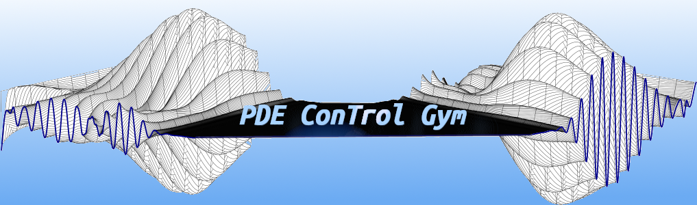

 <a href="#"></a>

<p>
<a href='https://pdecontrolgym.readthedocs.io/en/latest/?badge=latest'>
    
    </a>
<a href=https://arxiv.org/abs/2302.14265> 
    
</a>
</p>

## About this repository

This repository provides implementations of various PDEs including hyperbolic PDEs(Burger's Equation) and parabolic PDEs (Reaction-Diffusion/Heat Equations), and 2-D Navier Stokes PDEs that are all wrapped under a <a href=https://github.com/Farama-Foundation/Gymnasium>gym</a> designed for **boundary control problems**. These problems are particularly challenging because one has to handle nonlinearity across the entire domain with only a single value at each timestep requiring the solution of PDEs in the feedback loop. 

## Getting Started
To get started, we strongly suggest the user follows the <a href=https://pdecontrolgym.readthedocs.io/en/latest/guide/tutorials.html>documentation tutorial</a> for learning in a 1D environment once installation is complete. 

## Installation
Installing PDE Control Gym is simple, requires few dependencies, and is set to work with most Python Environments (Installation guide can be found in <a href=https://pdecontrolgym.readthedocs.io/en/latest/guide/install.html>docuementation</a> as well). This installation guide assumes you are familiar with either <a href=https://www.anaconda.com/>conda</a> or <a href=https://docs.python.org/3/library/venv.html>virtual env</a> in creating and installing python modules.

- First create a new enviornment for ***Python 3.10+***
- Install the dependencies. PDE ContRoL Gym requires
  - Gym Version 0.28.1 (<a href=https://github.com/Farama-Foundation/Gymnasium>Available here</a>)
  - Numpy Version 1.26.2 (<a href=https://numpy.org/>Available here</a>)
- To run the examples listed below or any reinforcement learning algorithm, the gym is currently setup using <a href=https://stable-baselines3.readthedocs.io/en/master/>Stable-Baselines3</a> Version 2.2.1.
- Once dependencies are installed, clone the repository using
  
  `git clone https://github.com/lukebhan/PDEControlGym.git`
- Then navigate to the working folder
  
  `cd PDEControlGym`
- Install the package using pip in the main folder
  
  `pip install -e .`
- Enjoy your fully functional PDE Control library! For usage, see the examples in either `./PDEControlGym/examples` or in the <a href=https://pdecontrolgym.readthedocs.io/en/latest/>documentation</a> or below in the examples section of this file!

## Documentation
Documentation for all the environments as well as tutorials are available <a href=https://pdecontrolgym.readthedocs.io/en/latest/>here</a>

## Examples
Jupyter notebooks are made in the examples folder (Hyperbolic and Parabolic subfolders) that detail all the examples for both Hyperbolic and Parabolic PDEs. Additionally, full details on numerical implementation and solvers are available in the 
<a href=https://pdecontrolgym.readthedocs.io/en/latest/>documentation</a>. These include tutorials on how to train your own RL controller, implemented backstepping controllers as well as plotting comparisons to analyze all of your work. For managing the training of your RL controller, we recommend you use <a href=https://github.com/tensorflow/tensorboard>tensorboard</a> as outlined in the notebooks. For pretrained models, please see the downloaded files on <a href=https://huggingface.co/lukebhan/PDEControlGymModels>Hugging Face</a>.  

## Contributions
Contributions to the gym are both welcome and encouraged. Please see the <a href=https://github.com/lukebhan/PDEControlGym/blob/main/CONTRIBUTING.md>contribution guidelines</a>. Any questions are welcome to email the author Luke at lbhan@ucsd.edu

## Citation
```
@misc{bhan2024pde,
      title={PDE Control Gym: A Benchmark for Data-Driven Boundary Control of Partial Differential Equations}, 
      author={Luke Bhan and Yuexin Bian and Miroslav Krstic and Yuanyuan Shi},
      year={2024},
      eprint={2405.11401},
      archivePrefix={arXiv},
      primaryClass={eess.SY}
}
```

## Licensing
<a rel="license" href="http://creativecommons.org/licenses/by-nc-sa/4.0/"></a><br />This work is licensed under a <a rel="license" href="http://creativecommons.org/licenses/by-nc-sa/4.0/">Creative Commons Attribution-NonCommercial-ShareAlike 4.0 International License</a>.
