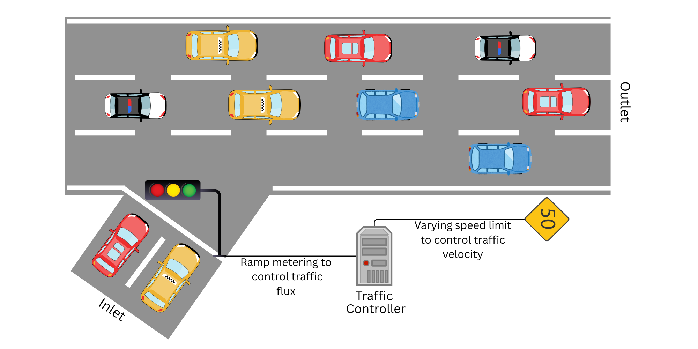

.. _Trafficarz1d:

.. automodule:: pde_control_gym.src.environments1d

Traffic ARZ 1D PDE
=========================

This documentation provides a detailed description of the ARZ PDE model for traffic control and its implementation.

Traffic congestion remains a major challenge as the world's population is rapidly growing. One particularly common form of congestion is stop-and-go traffic, which frequently occurs on busy freeways. Stop-and-go traffic is a result of delayed drivers response to changes in traffic flow. It makes the traffic flow across a freeway similiar to ocilliatory waves and this leads to unsafe driving conditions, increased fuel consumption, and higher emissions. Thus, it is crucial to develop effective control strategies to mitigate stop-and-go traffic in freeways. 

The ARZ PDE model is a well-known model for simulating stop-and-go traffic behavior on freeways as shown in the below figure. It consists of a system of coupled hyperbolic PDEs that describe how traffic density evolves over time and space.

Consider a freeway of length :math:`L` simulated over a time interval :math:`T`. Let :math:`\rho(x, t)` denote the traffic density (vehicles per unit length) and :math:`v(x, t)` the velocity of vehicles at a given position :math:`x` and time :math:`t`. The ARZ model captures the dynamics of these quantities through the following system of PDEs:

.. math::
    :nowrap:

    \begin{align}
    \rho_t + (\rho v)_x &= 0, \tag{1} \\
    (v - V(\rho))_t + v(v - V(\rho))_x &= \frac{V(\rho) - v}{\tau} \tag{2}
    \end{align}
Where,
    - :math:`V(\rho)` is the velocity-density relationship used to model the reduction of velocity with increase in traffic density,
    - :math:`\tau` is the relaxation time that represents the delay in the driver's response to changes in traffic flow,

The velocity-density relationship is typically modeled as a decreasing function of density, such as the Greenshield's model:

.. math::
    :nowrap:

    \begin{align}
    V(\rho) = v_m \left(1 - \frac{\rho}{\rho_{m}}\right) \tag{3}
    \end{align} 
    
Where, :math:`v_m` and :math:`\rho_{m}` are the maximum permissible velocity and density on the freeway.

The first equation (1) represents the conservation of vehicles which ensures that no vehicles appear or disappear within the road segment. On the otherhand second equation (2) captures the effect of velocity changes in response to traffic density variations.

The primary control objective is to regulate traffic flow in freeway around a steady-state :math:`(ρ^\star, v^\star)` that satisfies the equilibrium condition :math:`v^\star = V(ρ^\star)`. This is achieved by applying a control input :math:`u(t)` at the boundaries :math:`x = 0` and :math:`x=L` (entrance and exit) of the freeway. In practice, traffic flux :math:`q(x,t) = \rho(x, t) v(x, t)` is the most practical parameter to control on freeways. This can be achieved through ramp metering (controlling the rate vehicles enter or exit) or by adjusting speed limits at boundaries as shown in the above figure. We consider traffic flux as our primary control action. If we were to use speed limits are the control mechanism, then the control velocity can be determined directly from the traffic flux using the below Equation.

.. math::
    :nowrap:

    \begin{align}
    u(x,t) = q(x,t) = \rho(x, t) v(x, t) \tag{4}
    \end{align}

Three types of boundary control scenarios are possible for this problem:

1. Inlet control :math:`u_{in}(t)` at the entrance :math:`(x = 0)`

2. Outlet control :math:`u_{out}(t)` at the exit :math:`(x = L)`

3. Control at both inlet and outlet :math:`u_{in}(t)` and :math:`u_{out}(t)`

.. autoclass:: TrafficPDE1D
   :members:
   :exclude-members: truncate, terminate
 

Numerical implementation
----------------------
The Traffic ARZ PDE model is simulated using the below solution. The PDEs are transformed into an auxiliary variable to recasts the second PDE into conservative form to make it solvable using finite differencing methods. We define the auxiliary variable :math:`y` as:

.. math::
    :nowrap:

    \begin{align}
    y = \rho (v - V(\rho)) \tag{5}
    \end{align}

Then, the velocity can be expressed as:

.. math::
    :nowrap:

    \begin{align}
    v = \frac{y}{\rho} + V(\rho) \tag{6}
    \end{align}

The PDE in equation (1) is then transformed into:

.. math::
    :nowrap:

    \begin{align}
    \rho_t + (\rho v)_x &= 0 \tag{7} \\
    \rho_t + (y + \rho V(\rho))_x &= 0 \tag{8} \\
    \rho_t + (F_r(\rho, v))_x &= 0 \tag{9} \\
    \rho_t = -(F_r(\rho, &y))_x \tag{10}
    \end{align} 

Where, :math:`F_r(\rho, v) = y + \rho V(\rho)`.

The PDE in equation (2) is then transformed as follows:

.. math::
    :nowrap:

    \begin{align}
    (v - V(\rho))_t + v(v - V(\rho))_x &= \frac{V(\rho) - v}{\tau}  \tag{11} \\
    \rho (v - V(\rho))_t + \rho v(v - V(\rho))_x &= \rho \frac{V(\rho) - v}{\tau} \tag{12} \\
    y_t  + \left( y + \left( \frac{y}{p} + V(\rho)\right)\right)_x &= - \frac{y}{\tau} \tag{13} \\
    y_t  + (F_y(\rho,y))_x &= - \frac{y}{\tau} \tag{14} \\
    y_t  = - (F_y(\rho,y))_x &- \frac{y}{\tau} \tag{15}
    \end{align} 

Where, :math:`F_y(\rho,y) = y + \left( \frac{y}{p} + V(\rho)\right)`.

The PDEs are then discretized using the finite difference method. Let :math:`x_j = j \cdot \Delta x` and :math:`t^n = n \cdot \Delta t` be the spatial and time discretization variables respectively. The discretized form of :math:`\rho` and :math:`y` at the grid points :math:`(x_j, t^n)` is denoted as :math:`\rho_j^n` and :math:`y_j^n` respectively. The discretized PDEs are the solved using Lax-Friedrich's method. The Lax-Friedrich's method is a finite difference method used to solve hyperbolic PDEs. It is based on the idea of averaging the values of the solution at neighboring grid midpoints to obtain a new value at the current grid point. 

The soulutions at the right grid midpoint is given by:

.. math::
    :nowrap:

    \begin{align}
    \rho_{j+\frac{1}{2}}^n &= \frac{1}{2} \left( \rho_j^n + \rho_{j+1}^n \right) - \frac{\Delta t}{2\Delta x} \left[ F_r(\rho_{j+1}^n, y_{j+1}^n) - F_r(\rho_j^n, y_j^n) \right], \tag{16} \\
    y_{j+\frac{1}{2}}^n &= \frac{1}{2} \left( y_j^n + y_{j+1}^n \right) - \frac{\Delta t}{2\Delta x} \left[ F_y(\rho_{j+1}^n, y_{j+1}^n) - F_y(\rho_j^n, y_j^n) \right] - \frac{\Delta t}{4\tau} \left( y_j^n + y_{j+1}^n \right) \tag{17} 
    \end{align}

Similarly, the soulutions at the left grid midpoint is given by:

.. math::
    :nowrap:

    \begin{align}
    \rho_{j-\frac{1}{2}}^n &= \frac{1}{2} \left( \rho_j^n + \rho_{j-1}^n \right) - \frac{\Delta t}{2\Delta x} \left[ F_r(\rho_{j-1}^n, y_{j-1}^n) - F_r(\rho_j^n, y_j^n) \right], \tag{18} \\
    y_{j-\frac{1}{2}}^n &= \frac{1}{2} \left( y_j^n + y_{j-1}^n \right) - \frac{\Delta t}{2\Delta x} \left[ F_y(\rho_{j-1}^n, y_{j-1}^n) - F_y(\rho_j^n, y_j^n) \right] - \frac{\Delta t}{4\tau} \left( y_j^n + y_{j-1}^n \right)  \tag{19}
    \end{align}

The update equations for :math:`\rho` and :math:`y` at the grid points :math:`(x_j, t^{n+1})` are given by:

.. math::  
    :nowrap:

    \begin{align}
    \rho_j^{n+1} &= \rho_j^n - \frac{\Delta t}{\Delta x} \left[ F_r(\rho_{j+\frac{1}{2}}^n, y_{j+\frac{1}{2}}^n) - F_r(\rho_{j-\frac{1}{2}}^n, y_{j-\frac{1}{2}}^n) \right], \tag{20} \\
    y_j^{n+1} &= y_j^n - \frac{\Delta t}{\Delta x} \left[ F_y(\rho_{j+\frac{1}{2}}^n, y_{j+\frac{1}{2}}^n) - F_y(\rho_{j-\frac{1}{2}}^n, y_{j-\frac{1}{2}}^n) \right] - \frac{\Delta t}{2 \tau} \left( y_{j+\frac{1}{2}}^n + y_{j-\frac{1}{2}}^n \right) \tag{21}
    \end{align}

Finally, the velocity is reconstructed using:

.. math::
    :nowrap:

    \begin{align}
    v_j^{n+1} = \frac{y_j^{n+1}}{\rho_j^{n+1}} + V\left( \rho_j^{n+1} \right) \tag{22}
    \end{align}

