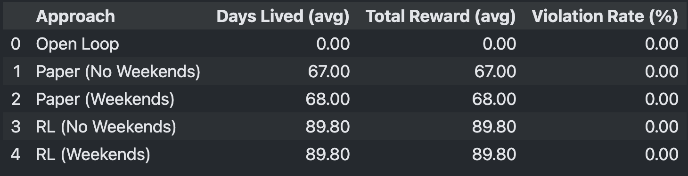
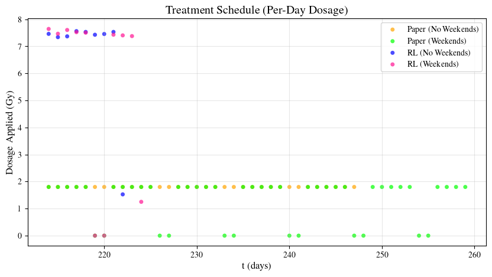

.. _braintumor:

Brain Tumor 1D PDE
================

This documentation describes the 1D Brain Tumor DPR (Diffusion-Proliferation-Radiation) Environment. The environment models the growth dynamics of glioblastomas–a fast-growing type of brain cancer–and their response to external beam radiation therapy (XRT). The model is governed by a partial differential equation (PDE) that includes three key terms: diffusion of tumor cells, proliferation, and radiation-induced cell death.

Background
------------------------

Glioblastoma is the most common malignant primary brain tumor, accounting for approximately 16% of all primary brain tumors [3]_.

Glioblastomas are fast-growing and highly aggressive, with a median survival time of only 15 months following diagnosis [3]_. Currently the standard treatment approach involves a combination of surgical resection (when possible), external beam radiation therapy (XRT), and concurrent chemotherapy. Magnetic Resonance Imaging (MRI) is used throughout treatment to monitor tumor progression and response to therapy.

Despite known differences in tumor growth across patients, clinical radiation therapy regimens remain largely standardized. This “one-size-fits-all” approach limits the ability to tailor treatment to individual tumors. Computational models such as the DPR framework aim to simulate tumor evolution under different protocols, offering a pathway toward more personalized therapy strategies.

Dimensional Model
------------------------

The dimensional model describes tumor growth as occuring in three spatial dimensions and time.

Let :math:`\mathcal{B} = [0, L]` denote the one-dimensional spatial domain of the brain, where :math:`x=0` corresponds to the tumor center and :math:`x=L` is the outer boundary of the simulation domain. This domain models radial tumor expansion under the assumption of spherical symmetry. 

Let :math:`\mathcal{T} = [0, T]` denote the time domain of the simulation. Let :math:`\mathcal{T}_{\text{therapy}}` represent the time intervals at which radiation therapy is administered. The tumor concentration :math:`c(x, t)` evolves according to the following PDE:

.. math::

   \begin{aligned}
   c_t(x, t) &= \overbrace{D\nabla^2 c}^{\text{diffusion}} + \overbrace{\rho c (1 - c/K)}^{\text{proliferation}} - \overbrace{R(\alpha, \beta, d(x, t), t) c (1 - c/K)}^{\text{radiation}}\,,  \quad && (x, t) \in \mathcal{B} \times \mathcal{T} \\
   c(x, 0) &= 0.8 K e^{-0.25x^2}, \quad && x \in \mathcal{B}  \\
   \mathbf{n} \cdot \nabla c(x, t) &=  0\,,  \quad &&  (x, t) \in \partial \mathcal{B} \times \mathcal{T}
   \end{aligned}

where a zero-flux (Neumann) boundary condition is imposed at the spatial boundaries to ensure that no tumor cells enter or leave the domain during the simulation. :math:`\nabla c` is the spatial gradient of the tumor concentration and :math:`\mathbf{n}` is the outward-pointing unit normal vector at the boundary :math:`\partial \mathcal{B}` of the spatial domain.

The radiation term :math:`R` is given by:

.. math::
   R(\alpha, \beta,  d(x, t), t) =
   \begin{cases}
   1 - S(\alpha, \beta, d(x, t)), & \text{if } t \in \mathcal{T}_{\text{therapy}} \\ 
   0, & \text{otherwise}
   \end{cases}

.. math::
  \begin{aligned}
   S(\alpha, \beta, d(x, t)) &= e^{-\alpha \cdot \gamma(\alpha, \beta, d(x, t))} \\
   \gamma(\alpha, \beta, d(x, t)) &= \varphi \cdot d(x,t) \cdot \left( 1 + \frac{d(x, t)}{\alpha / \beta} \right)
  \end{aligned}

**Definitions:**

- :math:`D`: diffusion coefficient in units :math:`(mm^2/day)`
- :math:`\rho`: proliferation rate in units :math:`(1/day)`
- :math:`K`: carrying capacity, maximum supported cell density, in units :math:`(cells/mm^3)`
- :math:`\varphi`: fractions per day (FPD). Describes how many parts each treatment day's dose is split into. 
- :math:`d(x, t)`: fractionated radiation dose in Gray :math:`(Gy = J/kg)` applied at spatial location :math:`x` and time :math:`t`. This value represents 1 of :math:`\varphi` dose fractions delivered at each treatment instance (:math:`\varphi \cdot d(x, t) =` total dosage given in 1 day of treatment). Dose distribution varies spatially depending on the tumor's size, and temporally based on treatment schedule
- :math:`\alpha`: radio-sensitivity parameter in :math:`(Gy^{-1})` that qualifies probability of immediate (single-hit) cell death caused by radiation. In the linear-quadratic model for radiation efficacy, this term governs the linear component of damage
- :math:`\beta`: radio-sensitivity parameter in :math:`(Gy^{-2})` that qualifies probability of quadratic (double-hit) cell death, where two radiation-induced sub-lethal damages combine to cause cell death. In the linear-quadratic model for radiation efficacy, this term governs the quadratic component of damage
- The function :math:`\gamma(\cdot)` represents the biologically effective dose (BED) which scales the efficacy of radiation treatment by number of fractions given by :math:`\varphi`, and :math:`\alpha` and :math:`\beta`
- The function :math:`S(\cdot)` represents the probability a tumor cell survives given that it received radiation dose :math:`d`
- The function :math:`R(\cdot)` represents the probability a tumor cell dies given that it received radiation dose :math:`d`

Radiation Therapy Schedule
------------------------

The external beam radiation therapy schedule follows a slightly modified version of the standard protocol adopted by the University of Washington Medical Center [1]_. 

In our environment, the schedule spans 34 treatment days of 1.8 :math:`(Gy)` each, delivered to the T2 region + a 25 mm margin for a total of 61.2 :math:`(Gy)`.

The environment supports both continuous treatment delivery over 34 consecutive days and a clinically realistic 5-days-on, 2-days-off schedule to account for weekend breaks.

Environment Implementation Details
------------------------

Our environment is built on mathematical modeling approaches developed in [1]_, [2]_, and [5]_, which are widely adopted in the glioblastoma modeling literature.

Simulated MRI Scans
^^^^^^^^^^^^^^^^^^^^^^^^^^^

Glioblastoma diagnosis and treatment monitoring are typically performed using two types of MRI scans: gadolinium enhanced T1-weighted and T2-weighted imaging (referred to here as T1 and T2, respectively). While these scans do not directly measure tumor cell density, prior modeling studies have established heuristic thresholds that map simulated tumor density to visible MRI regions [4]_:

- The T1 region corresponds to areas of high tumor cell density, typically >80% of the carrying capacity
- The T2 region corresponds to areas of moderate tumor cell density, typically >16% of the carrying capacity

Although our model explicitly evolves only the tumor cell density :math:`c`, these thresholds allow us to generate synthetic MRI images. By interpreting the density distribution at each timestep, we simulate the clinical appearance of T1 and T2 scans and track tumor radii dynamically over time. This also enables us to spatially define the radiation dose function :math:`d(x,t)` in accordance with evolving tumor boundaries during therapy.

Simulation Details
^^^^^^^^^^^^^^^^^^^^^^^^^^^

The simulation state :math:`c` is modeled as a two-dimensional array of shape :math:`(nt, nx)`, where each entry represents the tumor cell density at a specific time step and spatial position. The governing PDE is solved using an explicit finite-difference scheme.

The simulation proceeds through 3 sequential stages:

- **Growth Stage**: Beginning from the initial condition, the tumor undergoes unconstrained proliferation until the T1 detection radius of 15mm is reached. This marks the onset of the therapy stage.

- **Therapy Stage**: The radiation therapy schedule described above is applied. On each treatment day, the dose distribution :math:`d(x, t)` is recalculated based on the current T2 radius, determining the spatial region receiving radiation.

- **Post-Therapy Stage**: After completion of therapy, the tumor continues to grow freely until the T1 death radius of 35mm is reached or the simulation reaches its final temporal step.

Parameter Setting
^^^^^^^^^^^^^^^^^^^^^^^^^^^

- :math:`D` = 0.2 :math:`(mm^2/day)`
- :math:`\rho` = 0.03 :math:`(1/day)`
- :math:`K` = :math:`10^5 (cells/mm^3)`
- :math:`\varphi` = 1
- :math:`\alpha` = 0.04 :math:`(Gy^{-1})`
- :math:`\alpha / \beta` = 10 :math:`(Gy)`
- T1 detection radius = 15 :math:`(mm)`
- T1 death radius = 35 :math:`(mm)`
- Total treatment dosage = 61.2 :math:`(Gy)`

Parameters are adopted from this paper: [5]_

Reinforcement Learning Framework
------------------------

RL Formulation
^^^^^^^^^^^^^^^^^^^^^^^^^^^

The radiation therapy schedule described above represents a one-size-fits-all approach applied uniformly across patients, despite individual differences in tumor growth characteristics and radiation sensitivity 
(driven by varying diffusion coefficients, proliferation rates, and radio-sensitivity constants).

In our framework, we focus on the therapy stage and model it as a reinforcement learning problem.
Here, the tumor state :math:`c` is exposed as the observation space, and the RL agent 
determines the action--how much radiation dosage to apply--at each treatment step. 

A **hard constraint** enforces the total allowable radiation dose, whose depletion marks the end of therapy.
A **soft constraint**, derived from the clinically safe dosage for a given treatment radius, penalizes excessive dosage that may risk patient safety. 
The function :math:`dmaxsafe(treatmentRadius)` defining the safe dosage for a given treatment radius is extrapolated from clinical data in [6]_.

Our custom reward function encodes both treatment efficacy and safety to guide the RL agent toward an optimal, patient-specific therapy schedule.

Reward Function
^^^^^^^^^^^^^^^^^^^^^^^^^^^

The reward function, which the RL agent seeks to maximize, consists of two components: a large **episodic reward** and possibly negative **step reward**.

.. math::
  \begin{aligned}
   Rew_{episode}(t) &= t - t_{benchmark}\,,  \quad && t \in \text{deathDay}\\
  \end{aligned}

.. math::
   Rew_{step}(treatmentRadius, appliedDosage, totalDosage) =
   \begin{cases}
   0, & \\
   \text{if } appliedDosage \leq dmaxsafe(treatmentRadius) \\
   - \lambda \left(
       \frac{appliedDosage - dmaxsafe(treatmentRadius)}
            {totalDosage - dmaxsafe(treatmentRadius)}
     \right)^{1/3}, & \\
   \text{if } appliedDosage \gt dmaxsafe(treatmentRadius)
   \end{cases}

The episodic reward corresponds to the number of additional days the patient survives compared to a benchmark simulation with no treatment.

The step reward introduces a soft safety constraint, penalizing dosage values that exceed the safe clinical threshold. The cubic root ensures a smooth but stepp increase in penalty for even small violations.

The agent's objective is therefore to maximize total reward by extending survival while minimizing (ideally eliminating) violations of the safety constraint.

Training Setup
^^^^^^^^^^^^^^^^^^^^^^^^^^^

We implement a wrapper class to encapsulate the growth and post-therapy stages, simulating them internally so that they remain invisible to the RL agent.

The agent interacts only with the therapy stage, where it receives state observations :math:`c` and outputs a continuous action :math:`a \in [0, 1]`, representing the propotion of the remaining total dosage to apply at the current timestep.

If the proposed dosage exceeds the remaining allowed dose or meets a termination threshold, the environment automatically applies the remaining dosage and transitions to the post-therapy stage.

Results and Analysis
^^^^^^^^^^^^^^^^^^^^^^^^^^^

We compare the RL policy against three baselines:

1. Open Loop (No Control) - zero radiation dosage given
2. Paper Protocol (No Weekends) - based on the above defined radiation therapy schedule
3. Paper Protocol (Weekends) - based on the above defined radiation therapy schedule

Averaging over five simulation episodes, the RL-based schedule extends patient survival by **over 20 days** compared to traditional protocols, while maintaining complicance with the soft safety constraint.

Below is a summary table of the averaged results across all approaches:

The corresponding treatment schedules for a representative episode are shown below:

The figures below visualize the internal tumor state (cell density over time and space) for a representative episode of treatment approach:

.. raw:: html

   <table style="width:100%; text-align:center;">
     <tr>
       <td colspan="2" style="text-align:center;">
         
       </td>
     </tr>
     <tr>
       <td></td>
       <td></td>
     </tr>
     <tr>
       <td></td>
       <td></td>
     </tr>
   </table>

Numerical Implementation
------------------------

We derive the numerical implementation scheme for those looking for inner details of the environment. We use a first-order finite-difference scheme to approxiate the dimensionless PDE:

.. math::
  c_t(x, t) = D\nabla^2 c + \rho c (1 - c/K) - R(\alpha, \beta, d(x, t), t) c (1 - c/K)

Consider the first-order taylor approximation as

.. math::
  c(x, t+1) = c(x, t) + \Delta t \cdot c_t(x, t)

with finite spatial derivatives approximated by first-order centered differences where :math:`c_{j}^{n}` is shorthand for :math:`c(x_{j}, t_{n})`

.. math::
  \frac{\partial^2 c}{\partial x^2} = \frac{c_{j+1}^n - 2c_j^n + c_{j-1}^n}{(\Delta x)^2}

where :math:`\Delta t = dt = \text{time step}`, :math:`\Delta x= dx = \text{spatial step}`, :math:`n=0, ..., Nt`, :math:`j=0, ..., Nx`, where :math:`Nt` and :math:`Nx` are the total number of discretized temporal and spatial steps respectively. Substituting into our original equation yields

.. math::
  c_{j}^{n+1} = c_{j}^{n} + \Delta t (D \cdot (\frac{c_{j+1}^n - 2c_j^n + c_{j-1}^n}{(\Delta x)^2}) + \rho c_{j}^n (1 - c_{j}^n/K) - R(\alpha, \beta, d(x,t), t) c_{j}^n (1 - c_{j}^n/K))

The last thing to consider is the boundary conditions for finding :math:`c_{j}^{n+1}` when :math:`j = 0` or :math:`j = Nx`. In these cases, we set :math:`c_{0}^{n} = c_{1}^{n}` and :math:`c_{Nx}^{n} = c_{Nx-1}^{n}` respectively to create a symmetric and mirrored concentration field across the boundary to satisfy the no-flux boundary condition.

References
------------------------

.. [1] R. Rockne, E. C. Alvord, J. K. Rockhill, and K. R. Swanson, "`A mathematical model for brain tumor response to radiation therapy <https://pubmed.ncbi.nlm.nih.gov/18815786/>`_," 
  Journal of Mathematical Biology, vol. 58, no. 4-5, 2009.

.. [2] R. Rockne et al., "`Predicting efficacy of radiotherapy in individual glioblastoma patients in vivo: a mathematical modeling approach <https://pubmed.ncbi.nlm.nih.gov/20484781/>`_," 
  Physics in Medicine and Biology, vol. 55, no. 12, 2010.

.. [3] A. F. Tamimi, M. Juweid, "`Epidemiology and Outcome of Glioblastoma <https://www.ncbi.nlm.nih.gov/books/NBK470003/>`_," 
  PubMed, 2017.

.. [4] K. R. Swanson, R. C. Rostomily, and E. C. Alvord, "`A mathematical modelling tool for predicting survival of individual patients following resection of glioblastoma: a proof of principle <https://pubmed.ncbi.nlm.nih.gov/18059395/>`_," 
  British Journal of Cancer, vol. 98, no. 1, 2007.

.. [5] L. Hathout, B. Ellingson, and W. Pope, “`Modeling the efficacy of the extent of surgical resection in the setting of radiation therapy for glioblastoma <https://pmc.ncbi.nlm.nih.gov/articles/PMC4982585/>`_,” 
  Cancer Science, vol. 107, no. 8, 2016.

.. [6] J. M. Buatti, W. A. Friedman, S. L. Meeks, and F. J. Bova, "`PTOG 90-05: the real conclusion <https://www.redjournal.org/article/S0360-3016(99)00506-4/fulltext/>`_,"
  International Journal of Oncology Biology Physics, vol. 47, issue 2, 2000.
