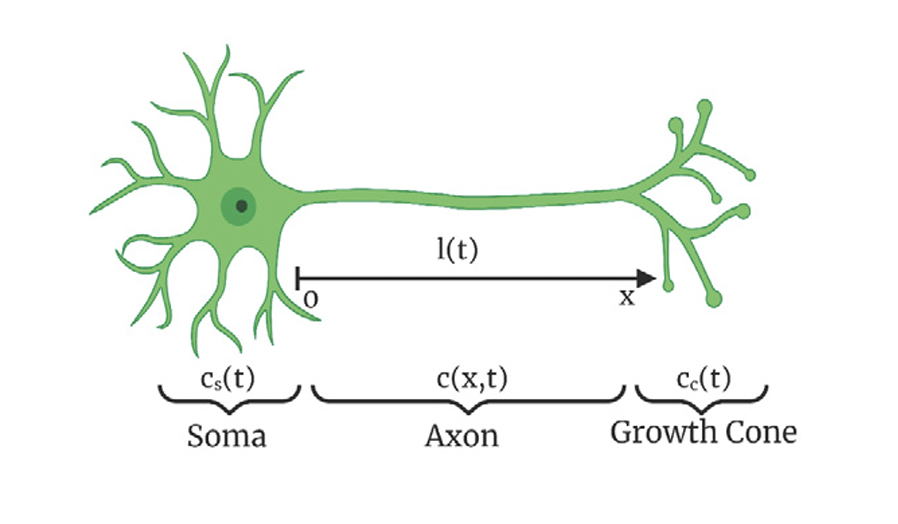

.. _neuron-1d:

.. automodule:: pde_control_gym.src.environments1d

Neuron Growth Control 1D PDE
=========================

This documentation provides a detailed description of a neuron growth control model and its implementation.

Neurological disorders such as Parkinson's disease, Alzheimer's disease, and spinal cord injuries limit the functionality of neurons. 
To cure these conditions, it has been suggested by medical experts to stimulate neuron axon growth by producing tubulin proteins.
Tubulin proteins extend the axon towards the target neuron, which in the end relay an electrical signal that allows human beings to gain perception.
These conditions, however, limit the functionality of neurons, as they degenerate and cause axon elongation to stop or shrink.
Thus, by surgically injecting Tubulin proteins in the brain of a patient, neuron functionality can be restored, serving as a remedy to what many have considered to be uncurable neurological disorders.
Moreover, a defined control law could produce an elongation of the axon to greater lengths and therefore enhance the effectiveness of these injections.

Consider a neuron with the following mathematical definitions:

- :math:`c(x,t)` represents the tubulin conentration in the axon.

- :math:`c_{eq}(x)` represents the desired tubulin concentration in the axon.

- :math:`c_c(t)` represents the tubulin concentration in the cone.

- :math:`c_\infty` represents the equilibrium of the tubulin concentration in the cone.

- :math:`l(t)` represents the length of the axon in the x-coordinate.

- :math:`l_s` is the desired length of the axon in the x-coordinate.

- :math:`q_s(t)` is the flux of the concentration in the soma.

- :math:`q^*_s` is the desired concentration flux in the soma.

The model establishes the following nonlinear error system using the above terms:

- To best approximate the tubulin concentration in the axon:

.. math::
    :nowrap:

    \begin{align}
    u(x,t) = c(x,t) - c_{eq}(x) \tag{1}
    \end{align}

- To best approximate the tubulin concentration in the cone:

.. math::
    :nowrap:

    \begin{align}
    z_1(t) = c_c(t)-c_\infty \tag{2}
    \end{align}

- To best approximate the length of the axon in the x-coordinate:

.. math::
    :nowrap:

    \begin{align}
    z_2(t) = l(t)-l_s  \tag{3}
    \end{align}

- To best approximate the concentration flux in the soma:

.. math::
    :nowrap:

    \begin{align}
    U(t) = -\left(q_s(t) - q^*_s\right)  = 0 \tag{4}
    \end{align}

This error system aims to make all functions equal to zero, as it would successfully achieve the desired state
for tubulin concentration in the axon and in the cone, the length of the axon, and the concentration flux in the soma.

Let :math:`Z(t)` be an ODE state vector for the reference error states :math:`z_1(t)` and :math:`z_2(t)` defined as the following:

.. math::
    :nowrap:

    \begin{align}
    Z(t) = [z_1(t)\quad z_2(t)]^T \tag{5}
    \end{align}

Linearizing the reference error system yields the following PDE and ODE equations:

.. math::
    :nowrap:

    \begin{align}
        u_t(x,t) &= Du_{xx}(x,t) - au_x(x,t) - gu(x,t) \tag{6} \\
    u_x(0,t) &= U(t) \tag{7} \\
        u(l(t),t) &= H^{T}Z(t) \tag{8} \\
            \dot{Z}(t) &= A_{1}Z(t) + Bu_x(l(t),t) \tag{9} 

    \end{align}

Parameters used to simulate our linearized reference error system:

:math:`D = 10\cdot10^{-12}  m^{2}/s \quad \quad \quad \quad a = 1\cdot10^{-8} m/s`

:math:`g = 5\cdot10^{-7} s^{-1}\quad\quad \quad \quad\quad \quad   r_{g} = 1.783\cdot10^{-5} m^{4}/mol\cdot s`

:math:`c_\infty = 0.0119 mol/m^{3}\quad \quad \quad \quad \tilde{r}^{}_{g} = 0.053`

:math:`\gamma = 10^{4}\quad \quad \quad \quad \quad \quad \quad \quad \quad l_{c} = 4\cdot10^{-6}m`

:math:`l_{s} = 12\cdot10^{-6}m\quad \quad \quad \quad \quad \quad l_{0} = 1\cdot10^{-6}m`

:math:`H = [1\quad 11.8976]^T \quad \quad \quad \quad A_1 = \begin{bmatrix} -0.0505 & 1.049 \cdot 10^6 \\ 1.738 \cdot 10^{-5} & 0 \end{bmatrix}`

:math:`B = [-2.5 \cdot 10^{-6} \quad 0]^T`

Numerical implementation
----------------------

We first start by establishing our initial conditions:

.. math::
    :nowrap:

    \begin{align}
    Z(0) = \left[-c_\infty\quad -\frac{l_{s}}{2}\right]^T, \quad u(x,0) = 2c_\infty
    \end{align}

The PDEs and ODEs are then discretized using the finite differencing method. Let :math:`x_n = n \cdot \delta x` and :math:`t^j = j \cdot \delta t` be the spatial and time discretization variables respectively. 

Also, let the discretized point of :math:`l(t)` be given by :math:`L`, where :math:`L = \frac {l(t)}{\delta x}`. This is also an extension of the spatial discretizations variable :math:`x_n`

The discretized form of :math:`u` and :math:`Z` at the grid points :math:`(x_n, t^j)` is denoted as :math:`u_n^j` and :math:`Z^j` respectively.

- The solution to find the tubulin concentration in the axon in the next time step is:

.. math::
    :nowrap:

    \begin{align}
    u^{j+1}_n = \delta t\left[D\left(\frac{u^j_{n+1} - 2u^j_n + u^j_{n-1}}{δx^2}\right) - a\left(\frac{u^j_{n+1} - u^j_n}{\delta x}\right) - gu^j_n\right] + u^j_n \tag{10}
    \end{align}

- The solution to find the tubulin concentration in the axon in the leftmost boundary of the grid is:

.. math::
    :nowrap:

    \begin{align}
    u^{j}_0 = u^{j}_1 \tag{11}
    \end{align}

- The solution to best approximate, in the next time step, the tubulin concentration in the cone and the length of the axon in the x-coordinate is given by:

.. math::
    :nowrap:

    \begin{align}
    Z^{j+1} = Z^j + δt\left[A_1Z^j + B\left(\frac{u^j_{L-1} - u^j_{L}}{δx}\right)\right] \tag{12}
    \end{align}

- Using (12), the following is the solution for finding the  tubulin concentration in the axon at the rightmost boundary of the grid

.. math::
    :nowrap:

    \begin{align}
    u^{j+1}_{L} = H^{T}Z^{j+1} \tag{13}
    \end{align}

