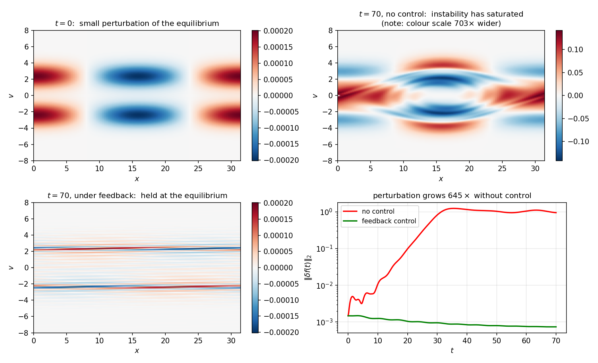
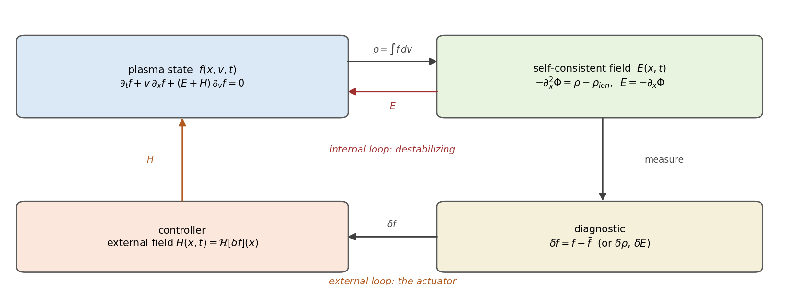
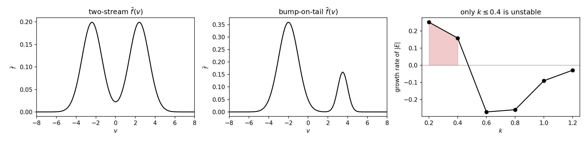
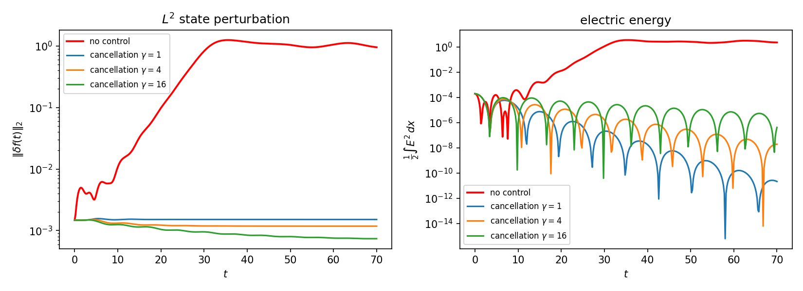
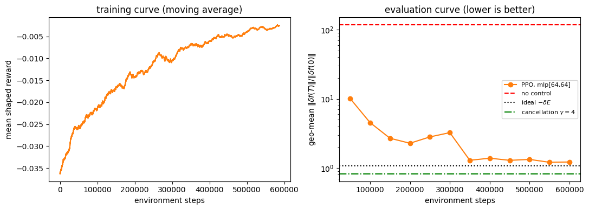

.. _vlasovpoisson1d:

.. automodule:: pde_control_gym.src.environments1d

Vlasov-Poisson 1D PDE (Plasma)
================================================

   The problem. A collisionless plasma is placed near an unstable two-stream equilibrium
   with a perturbation of relative size :math:`10^{-3}` (top left). Left alone, the plasma's
   own electric field amplifies that perturbation exponentially until it rolls up into a
   phase-space vortex and the confined state is destroyed (top right, on a colour scale
   700 times wider). Under feedback through an externally applied electric field, the
   perturbation is held at its initial size for the whole horizon (bottom left), and only
   fine filaments along the beams remain. Bottom right shows the two histories: a factor of
   645 of growth without control against a slow decay with it.

This documentation describes the 1D1V Vlasov-Poisson environment, a kinetic model of a
collisionless plasma controlled by an externally applied electric field. The state is a
distribution over phase space rather than a field over physical space, which makes this
the highest-dimensional state in the gym, and the actuator is distributed over the whole
domain rather than acting at a boundary.

Background
------------------------

Sustained nuclear fusion requires that a plasma stay confined for long periods, and the
main obstacle is that the confined state is often not a stable one. A small deviation from
equilibrium can be amplified by the electric field the plasma itself generates, growing
exponentially until the plasma is nothing like the state it started in.

Two such instabilities are standard test cases. The **two-stream instability** arises when
two populations of particles counter-stream through one another, and it scatters the beams
and destroys their focus. The **bump-on-tail instability** arises when a small fast
population sits on the tail of a bulk distribution, as happens with runaway electrons or
under radiofrequency heating, and it degrades confinement and deposits energy on the
reactor walls. Both are driven by the same mechanism, energy flowing from the particles
into electrostatic waves, and both are suppressed the same way, by applying an external
electric field shaped to cancel the field the plasma is using to destabilize itself.

The environment implements the model and the feedback laws of Lu, Wang and Calder [1]_,
whose notation is followed throughout.

Problem Formulation
------------------------

   Notation and the two feedback paths. The plasma generates its own field :math:`E`
   through the Poisson equation, and for an unstable equilibrium that internal loop is
   what drives the growth. The control adds a second, external loop: an applied field
   :math:`H` computed from a measurement of the deviation :math:`\delta f` from the target
   equilibrium.

Let :math:`f(x, v, t)` denote the particle distribution over phase space, that is, the
density of particles at position :math:`x` moving with velocity :math:`v` at time
:math:`t`. Integrating out velocity gives the charge density :math:`\rho(x,t)`, which
generates the self-consistent electric field :math:`E(x,t)` through the Poisson equation.
Writing :math:`H(x,t)` for the external field applied as control, the dynamics are

.. math::
    :nowrap:

    \begin{align}
    \partial_t f(x,v,t) + v\, \partial_x f(x,v,t) + \big(E(x,t) + H(x,t)\big)\, \partial_v f(x,v,t) &= 0, \tag{1} \\
    E(x,t) = -\partial_x \Phi(x,t), \qquad -\partial_x^2 \Phi(x,t) &= \rho(x,t) - \rho_{ion}, \tag{2} \\
    \rho(x,t) &= \int f(x,v,t)\, dv, \tag{3}
    \end{align}

on a spatial domain :math:`x \in [0, X]` with periodic boundary conditions and a truncated
velocity range :math:`v \in [-v_{max}, v_{max}]`. The symbols are:

- :math:`f(x,v,t)` is the state, a nonnegative density over the two-dimensional phase space :math:`[0,X] \times [-v_{max}, v_{max}]`,
- :math:`\rho(x,t)` is the charge density, the zeroth velocity moment of :math:`f`,
- :math:`j(x,t) = \int v f \, dv` is the current, the first velocity moment, used in the energy budget below,
- :math:`\Phi(x,t)` is the electrostatic potential and :math:`E(x,t) = -\partial_x \Phi` the field the plasma generates,
- :math:`\rho_{ion}` is a fixed neutralizing background of ions, taken as constant because the ions are far heavier than the electrons and barely move on the timescale of interest,
- :math:`H(x,t)` is the control, an externally applied electric field.

Equation (1) is a transport equation: :math:`f` is carried along the characteristics of
the flow, with particles moving at their velocity and accelerating under the total field
:math:`E + H`. Equations (2) and (3) close the loop by making the field a functional of the
distribution itself, and it is that closure which makes some equilibria unstable.

Any velocity profile :math:`\bar f(v)` with no spatial dependence is an equilibrium of the
uncontrolled system, since :math:`v \partial_x \bar f = 0` and the resulting field vanishes
when :math:`\int \bar f dv = \rho_{ion}`. Whether it is *stable* is decided by the Landau
dispersion relation: a single Maxwellian is, and perturbations to it decay by phase mixing,
the classical Landau damping. A mixture of two Gaussians is not. The two unstable equilibria
provided in ``examples/vlasovPoisson/utils.py`` are

.. math::
    :nowrap:

    \begin{align}
    \bar f_{\text{two-stream}}(v) &= \frac{1}{2\sqrt{2\pi}} e^{-(v - \bar v)^2 / 2} + \frac{1}{2\sqrt{2\pi}} e^{-(v + \bar v)^2 / 2}, \qquad \bar v = 2.4, \tag{4} \\
    \bar f_{\text{bump-on-tail}}(v) &= \frac{\omega_1}{\sqrt{2\pi}} e^{-(v - \bar v_1)^2 / 2} + \frac{\omega_2}{\sqrt{2\pi} v_t} e^{-(v - \bar v_2)^2 / 2 v_t}, \tag{5}
    \end{align}

with :math:`\omega_1 = 0.9`, :math:`\omega_2 = 0.1`, :math:`\bar v_1 = -2`,
:math:`\bar v_2 = 3.5` and :math:`v_t = 0.25`.

   The two shipped equilibria, and the measured growth rate of :math:`|E|` for each spatial
   harmonic of the two-stream case on :math:`X = 10\pi`. Only the first two harmonics grow;
   from :math:`k = 0.6` up the modes are Landau damped and need no control.

The control objective is to hold the plasma at a chosen :math:`\bar f`, so the quantity
that is observed, penalized and reported throughout is the deviation

.. math::
    :nowrap:

    \begin{align}
    \delta f(x,v,t) = f(x,v,t) - \bar f(v), \tag{6}
    \end{align}

and the control problem is to choose :math:`H` so as to minimize the running cost of
equation (2.2) of the paper,

.. math::
    :nowrap:

    \begin{align}
    J = \int_0^T \left( \frac{1}{2}\|\delta f(\cdot,\cdot,t)\|^2_{x,v} + \frac{\gamma}{2}\|H(\cdot,t)\|^2_{x} \right) dt, \tag{7}
    \end{align}

with :math:`\gamma \ge 0` weighting control effort. This is implemented by the
``VlasovPoissonReward`` class, which returns the negated integrand at each step.

.. warning::

   Unlike every other environment in the gym, this is **not** a boundary control problem.
   The spatial domain is periodic and therefore has no boundary, so :math:`H` is a field
   distributed across the whole domain. What the agent is allowed to shape is set by
   ``action_type``.

What the control can and cannot reach
--------------------------------------

Large parts of this state are provably out of reach of any :math:`H`, which is unusual and
worth stating before anyone tries to regulate :math:`\delta f` to zero. Every claim below
is checked numerically by ``examples/vlasovPoisson/vlasovPoisson1DtestSolver.py``.

**Casimirs are invariant under every control.** Equation (1) transports :math:`f` along a
divergence-free flow in phase space no matter what :math:`H` is applied, so
:math:`\int\int G(f)\, dx\, dv` is conserved for every function :math:`G`: total mass, every
:math:`L^p` norm of :math:`f`, and the entropy. At any time :math:`f(\cdot, t)` is a
measure-preserving rearrangement of :math:`f_0`. If :math:`f_0` is not already a
rearrangement of :math:`\bar f`, no control whatsoever can drive :math:`f \to \bar f`, and
:math:`\|\delta f\|_2` cannot be driven to zero. The perturbation can only be stirred to
finer and finer scales in velocity, which is the filamentation visible in the bottom-left
panel of the headline figure. Suppressing the *macroscopic* signature of the instability,
the electric field and the low-order moments, is achievable; erasing the perturbation is
not.

**Two scalars are driven purely by the control.** The self-consistent field contributes
nothing to the momentum or energy budgets, so

.. math::
    :nowrap:

    \begin{align}
    \frac{d}{dt} \int\!\!\int v f \, dx\, dv &= \int H \rho \, dx, \tag{8} \\
    \frac{d}{dt} \left( \frac{1}{2}\int\!\!\int v^2 f \, dx\, dv + \frac{1}{2}\int E^2 dx \right) &= \int H j \, dx. \tag{9}
    \end{align}

These are the two directions in which the actuator has unobstructed authority, and both are
reported every step as ``momentum_rate`` and ``energy_rate`` alongside the quantities they
drive. Energy authority vanishes when the current :math:`j` does, so a symmetric plasma at
rest cannot be heated or cooled instantaneously.

**The actuator has no velocity resolution.** :math:`H` is a function of :math:`x` only and
enters as :math:`H \partial_v f`. Linearized about :math:`\bar f`, the input operator is
:math:`B : H(x) \mapsto -H(x) \partial_v \bar f(v)`, a rank-:math:`n_x` map into an
:math:`n_x n_v` dimensional phase space, under one percent of the state directions at the
default resolution. So the same force acts on every velocity class at a given :math:`x`, and
a bump-on-tail beam cannot be decelerated without also accelerating the bulk; and only the
component of :math:`\delta f` aligned with :math:`\partial_v \bar f` is directly actuated.

**Mode by mode, the instability is controllable and the continuum is not.** Around a
homogeneous :math:`\bar f(v)` the linearized system decouples in the spatial Fourier index,
with mode :math:`k` obeying

.. math::
    :nowrap:

    \begin{align}
    \partial_t \delta f_k + i k v\, \delta f_k + \big(\delta E_k + H_k\big) \bar f'(v) = 0. \tag{10}
    \end{align}

The control enters only through the fixed profile :math:`\bar f'(v)`, so its reachable set
is the span of the free-streaming translates :math:`\{e^{-ikvt}\bar f'(v)\}`. The unstable
eigenmodes lie in exactly that subspace, because they are electrostatic: they have
:math:`\delta E_k \ne 0` and :math:`H_k` can cancel it term for term. What remains is the
van Kampen continuum, which is unreachable but also neutrally stable and phase-mixes on its
own. The practical consequence is the one measured in the equilibria figure: the actuator
only has to cover the harmonics that actually grow.

**Observability is limited the same way.** With ``sensing_type="density"`` or ``"field"``
the agent sees only a velocity moment of :math:`\delta f`. The phase-mixing continuum
contributes to :math:`\rho` only through a decaying transient and is essentially
unobservable from field diagnostics, while the unstable eigenmodes are both observable and
controllable. Concretely, the :math:`-\delta E` term of the feedback law below is a
functional of :math:`\delta\rho` alone and can be implemented from a density measurement,
but the dissipation term cannot, and needs ``"full"`` sensing.

Environment Implementation Details
--------------------------------------

Simulation Details
^^^^^^^^^^^^^^^^^^^^^^^^^^^

The simulation state is a two-dimensional array of shape :math:`(n_x, n_v)` holding
:math:`f` at the grid points :math:`x_i = i \Delta x` and :math:`v_j = -v_{max} + j \Delta v`,
with :math:`n_x` set by ``X``/``dx`` and :math:`n_v` by ``V``/``dv``. When ``store_history``
is ``True`` the whole :math:`(n_t, n_x, n_v)` trajectory is retained for plotting and for
the reward class; set it to ``False`` on fine grids, where that array becomes large.

Equation (1) is advanced by a Strang-split semi-Lagrangian scheme. Splitting is natural
here because the equation separates into two pieces that can each be solved *exactly* along
characteristics: transport in :math:`x` at fixed :math:`v`, and transport in :math:`v` at
fixed :math:`x`. Each stage is therefore a shift of the distribution followed by an
interpolation back onto the grid, which makes the scheme fully explicit and, unlike a
finite difference discretization of (1), free of any CFL restriction on :math:`\Delta t`.
One step is

.. math::
    :nowrap:

    \begin{align}
    f^{(1)}(x, v) &= f\left(x - \tfrac{\Delta t}{2} v,\; v,\; t^n\right), \tag{11} \\
    f^{(2)}(x, v) &= f^{(1)}\left(x,\; v - \big(E[f^{(1)}](x) + H(x)\big)\Delta t\right), \tag{12} \\
    f^{n+1}(x, v) &= f^{(2)}\left(x - \tfrac{\Delta t}{2} v,\; v\right), \tag{13}
    \end{align}

with the field in stage (12) recomputed from the half-advected state :math:`f^{(1)}`, which
is what makes the splitting second order in :math:`\Delta t`.

For the streaming stages the departure point of node :math:`i` is :math:`x_i - s_j \Delta x`
with :math:`s_j = v_j \Delta t / 2\Delta x`. Writing
:math:`s_j = \lfloor s_j \rfloor + \{s_j\}`, that point lies between nodes
:math:`i - \lfloor s_j \rfloor - 1` and :math:`i - \lfloor s_j \rfloor`, at local coordinate
:math:`\sigma = 1 - \{s_j\}`, so the update is a weighted sum over a stencil around it:

.. math::
    :nowrap:

    \begin{align}
    f^{(1)}_{i,j} = \sum_{m} w_m(\sigma) \; f^{\,n}_{\,(i - \lfloor s_j \rfloor - 1 + m) \bmod n_x,\; j}, \tag{14}
    \end{align}

the modulo implementing periodicity in :math:`x`. Stage (12) is the same construction along
:math:`j` with shift :math:`(E_i + H_i)\Delta t / \Delta v`, except that the velocity domain
is a truncation rather than a period, so stencil points falling outside :math:`[0, n_v)`
contribute zero. The ``interpolation`` parameter selects the weights, either the two point
linear set

.. math::
    :nowrap:

    \begin{align}
    w_0 = 1 - \sigma, \qquad w_1 = \sigma, \tag{15}
    \end{align}

or the four point Lagrange set on the stencil :math:`m \in \{-1, 0, 1, 2\}`,

.. math::
    :nowrap:

    \begin{align}
    w_{-1} &= -\tfrac{1}{6}\sigma(\sigma-1)(\sigma-2), &
    w_{0} &= \tfrac{1}{2}(\sigma+1)(\sigma-1)(\sigma-2), \tag{16} \\
    w_{1} &= -\tfrac{1}{2}(\sigma+1)\sigma(\sigma-2), &
    w_{2} &= \tfrac{1}{6}(\sigma+1)\sigma(\sigma-1). \tag{17}
    \end{align}

The Poisson solve (2) is spectral when ``poisson_solver="periodic"``. Writing
:math:`\widehat{c}` for the discrete Fourier transform of the net charge
:math:`c = \rho - \rho_{ion}`,

.. math::
    :nowrap:

    \begin{align}
    \widehat{E}_k = \frac{\widehat{c}_k}{i k}, \quad k \ne 0, \qquad \widehat{E}_0 = 0, \tag{18}
    \end{align}

the :math:`k = 0` mode fixed to zero as the only choice consistent with a periodic
potential. With ``poisson_solver="dirichlet"`` the solve instead uses the Green's function
of :math:`-\partial_x^2` on :math:`[a,b]` with zero boundary data,

.. math::
    :nowrap:

    \begin{align}
    G(x, y) = \begin{cases} (x-a)(b-y)/(b-a), & a \le x \le y \le b, \\ (y-a)(b-x)/(b-a), & a \le y \le x \le b, \end{cases} \tag{19}
    \end{align}

assembled once into a dense matrix so that :math:`E = -\int \partial_x G(x,y) c(y)\, dy` is
a single matrix-vector product. This reproduces the :math:`\Phi(0) = \Phi(X) = 0` setup of
Section 3.1 of the paper.

.. note::

   ``interpolation`` defaults to the cubic stencil (16)-(17) rather than the bilinear scheme
   of the paper, and for benchmarking the difference matters. The numerical diffusion a two
   point stencil introduces per step is proportional to :math:`\sigma(1-\sigma)\Delta^2`,
   and since :math:`\sigma \propto \Delta t` the diffusion accumulated over a fixed horizon
   is *independent of* :math:`\Delta t`. It cannot be refined away in time, only by raising
   the order or the resolution, and it appears as a spurious decay of
   :math:`\|\delta f\|_2` that flatters any controller. On the reference two-stream case it
   removes about 45% of :math:`\|\delta f\|_2` over :math:`t \in [0, 40]` on its own.

   With the cubic stencil the pure cancellation law at :math:`\gamma = 0` conserves
   :math:`\|\delta f\|_2` to 2% over that horizon, as the continuous theory says it must,
   and linear Landau damping rates come out within 3% of the roots of the dispersion
   relation at :math:`k = 0.4` and :math:`k = 0.5`. Set ``interpolation="linear"`` to
   reproduce the paper exactly, or if positivity of :math:`f` matters more to you than
   dissipation, since the cubic stencil can undershoot below zero at sharp features.

Action Space
^^^^^^^^^^^^^^^^^^^^^^^^^^^

``action_type`` selects how the action is expanded into the nodal values :math:`H(x_i)`:

- ``"modal"`` treats the action as the coefficients :math:`\alpha_k` of a truncated Fourier
  basis, :math:`H(x) = \sum_k \alpha_k \varphi_k(x)` with
  :math:`\{\varphi_k\} = \{1, \sin(2\pi l x / X), \cos(2\pi l x / X)\}_{l \le K}` and
  :math:`K` set by ``num_modes``. This is the parameterization of the paper, and it makes
  the actuated wavenumbers explicit. Harmonics above :math:`K` are exactly uncontrollable.
- ``"field"`` treats the action as the nodal values directly, giving full authority over
  :math:`H` on the grid, so the action has length :math:`n_x`.

``include_uniform_mode=False`` additionally projects the spatially uniform component out of
every basis function, so :math:`\int_0^X H\,dx = 0` and :math:`H` is the gradient of a
periodic potential. The now-redundant constant basis function is dropped from the action
space rather than left in as an inert coordinate. ``max_control_value`` bounds the control
when ``normalize`` is ``True``, in which case actions in :math:`[-1, 1]` are rescaled to
:math:`[-` ``max_control_value`` :math:`,` ``max_control_value`` :math:`]`.

Observation Space
^^^^^^^^^^^^^^^^^^^^^^^^^^^

``sensing_type`` selects what is returned, always computed from :math:`\delta f` rather
than :math:`f`:

- ``"full"`` returns :math:`\delta f` on the whole :math:`(n_x, n_v)` grid,
- ``"density"`` returns :math:`\delta\rho(x)`, shape :math:`(n_x,)`,
- ``"field"`` returns :math:`\delta E(x)`, shape :math:`(n_x,)`,
- ``"moments"`` returns the first three velocity moments of :math:`\delta f`, shape :math:`(3, n_x)`.

``sensing_noise_func`` is applied to the observation before it is returned, which is how the
noisy-diagnostic experiments of Section 3.4 of the paper are reproduced.

Episode Termination
^^^^^^^^^^^^^^^^^^^^^^^^^^^

An episode terminates when the ``T`` timesteps are reached. Setting
``limit_pde_state_size=True`` additionally truncates the episode early if
:math:`\|\delta f\|_2` exceeds ``max_state_value`` or the state stops being finite, which is
worth enabling during RL training where a bad policy can drive the solver to blow up.
``control_sample_rate`` holds the action constant over that many time units while the PDE is
advanced at resolution ``dt``, allowing the controller to run slower than the solver.

Diagnostics
^^^^^^^^^^^^^^^^^^^^^^^^^^^

Every ``step`` returns an ``info`` dict holding the applied field ``H`` and resulting field
``E``, the quantities ``mass``, ``momentum``, ``kinetic_energy`` and ``electric_energy``,
the right hand sides of (8) and (9) as ``momentum_rate`` and ``energy_rate``, and
``l2_perturbation`` for :math:`\|\delta f(t)\|_2`. Together these let a user verify that the
solver conserves what it should and that the control moves only what it can.

API Reference
^^^^^^^^^^^^^^^^^^^^^^^^^^^

See the Utilities -> Pre-implemented Rewards section for the ``VlasovPoissonReward`` class
implementing the cost (7).

.. autoclass:: VlasovPoisson1D
   :members:
   :exclude-members: truncate, terminate

Results
------------------------

The training-free feedback law of [1]_, derived in its Section 4 by taking an energy
estimate on the equation for :math:`\delta f`, is

.. math::
    :nowrap:

    \begin{align}
    H[\delta f](x) &= -\delta E[\delta f](x) + \gamma \int \delta f(x,v,t)\, \partial_v \bar f(v)\, dv, \tag{20} \\
    \tfrac{1}{2}\tfrac{d}{dt}\|\delta f(t)\|_2^2 &= -\gamma \int \left( \int \delta f\, \partial_v \bar f\, dv \right)^{2} dx \;\le\; 0, \tag{21}
    \end{align}

so the first term removes the destabilizing field and the second guarantees a nonincreasing
perturbation norm for any :math:`\gamma > 0`. It depends only on :math:`\bar f`, needs no
training, and is implemented as ``CancellationController`` in
``examples/vlasovPoisson/utils.py``. Note what (21) does not say: only the component of
:math:`\delta f` aligned with :math:`\partial_v \bar f` appears on the right hand side, so
the orthogonal complement is not directly damped.

   Two-stream instability over :math:`t \in [0, 70]` from a :math:`10^{-3}` perturbation.
   Without control the perturbation grows by a factor of 645 and the electric energy by
   about six orders of magnitude. Under (20) the perturbation stays flat, with larger
   :math:`\gamma` giving faster decay: the final ratios are 1.03, 0.80 and 0.50 for
   :math:`\gamma = 1, 4, 16`.

A PPO agent can learn a comparable law from interaction, though the environment needs
conditioning first. An unstable perturbation grows two to three orders of magnitude within
one episode, so the observation spans that range and the quadratic cost (7) spans its
square, and no fixed set of network weights responds usefully at both ends. The useful
control amplitude is also small and phase-sensitive, so exploration noise at a comparable
scale drives the instability rather than damping it. ``ScaleFreeVlasov`` in
``examples/vlasovPoisson/utils.py`` handles this by dividing the observation by its own
magnitude and appending the :math:`\log_{10}` of that magnitude, interpreting the action as
a multiple of the same magnitude, and replacing the reward by the per-step log growth
factor. The cost (7) stays available under ``info["paper_reward"]`` so it remains the
reported metric.

Rescaling by amplitude is justified by the structure of the problem rather than being a
convenience: Section 2.1 of the paper shows via the Pontryagin maximum principle that the
optimal control for the linearized system is a *linear* functional of :math:`\delta f`,
hence positively homogeneous in it, so one set of weights represents that law at every
amplitude once the scale is removed.

   PPO with ``net_arch=[64, 64]`` at ``lr=3e-4``, observing :math:`\delta E` and acting
   through the first two Fourier harmonics. The right panel evaluates the deterministic
   policy every 50k steps on a fixed set of eight episodes; it reaches a growth factor of
   about 1.2 by 350k steps and plateaus just above the analytic law.

Scoring every policy on the same fixed episodes, as the notebook does:

.. list-table::
   :header-rows: 1
   :widths: 40 30 30

   * - policy
     - cost (7) with :math:`\gamma = 0`
     - geometric-mean growth factor
   * - no control
     - :math:`-2.63 \times 10^{0}`
     - 117.4
   * - cancellation, :math:`\gamma = 1`
     - :math:`-3.31 \times 10^{-4}`
     - 0.993
   * - cancellation, :math:`\gamma = 4`
     - :math:`-2.59 \times 10^{-4}`
     - 0.823
   * - cancellation, :math:`\gamma = 16`
     - :math:`-1.85 \times 10^{-4}`
     - 0.622
   * - best policy expressible in the wrapped action space
     - :math:`-3.72 \times 10^{-4}`
     - 1.079
   * - PPO after 600k steps
     - :math:`-4.37 \times 10^{-4}`
     - 1.221

Growth factors are reported as a geometric mean, since a growth factor is multiplicative
across episodes with a spread of growth rates. Single checkpoints are noisy on this problem,
so the learning curve above is more informative than the final row alone.

The learning rate is tied to the architecture and cannot be carried over from elsewhere: at
``lr=1e-3`` the same network diverges, reaching growth factors of 74 and 135 by 400k steps
on two seeds, ``net_arch=[256, 256]`` settles around 900, worse than applying no control at
all, and a ReLU activation in place of tanh is worse again. A bare ``net_arch=[]`` is well
matched to the problem for the reason given above, trains stably at ``lr=1e-3``, and reaches
the same growth factor in roughly a third of the samples; measured over three seeds out to
1.2M steps the late-phase growth factor averaged 1.33 for the linear policy against 1.27 for
the MLP, which is a tie.

Examples
------------------------

``examples/vlasovPoisson`` contains:

- ``VlasovPoisson1DExample.ipynb``, a worked notebook that identifies which harmonics are
  unstable, builds both baselines, and trains a PPO agent against them,
- ``vlasovPoisson1Dcancellation.py``, reproducing the two-stream experiment of Section 4
  with the feedback law (20),
- ``vlasovPoisson1Dppo.py``, the script form of the notebook's training run,
- ``vlasovPoisson1DtestSolver.py``, which checks the invariants, the budget identities (8)
  and (9), linear Landau damping, and the reachability limits described above.

References
------------------------

.. [1] J. Lu, L. Wang, and J. Calder, "`Dynamical feedback control with operator learning
  for the Vlasov-Poisson system <https://arxiv.org/abs/2509.23063>`_," arXiv:2509.23063,
  2025.
