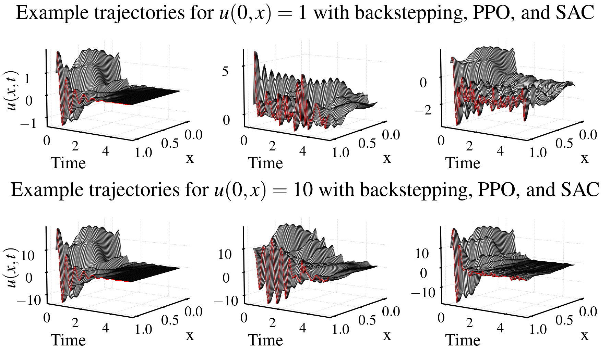
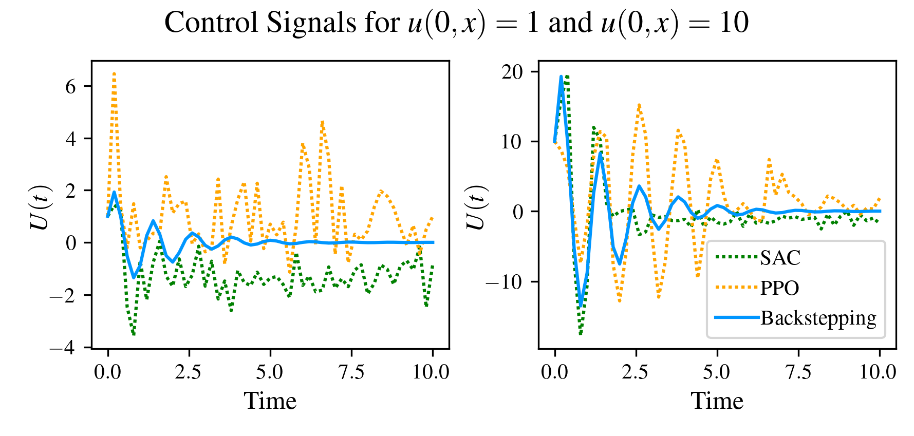
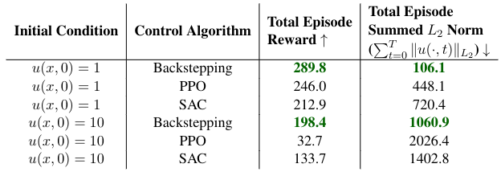

.. _tutorials:

Tutorials
=========

.. note::
   Examples are fully built out in Jupyter-notebooks for 1D Hyperbolic and Parabolic PDEs. Our tutorial in this documentation is aimed
   to demonstrate the use of the library and the basic workings of its parameters.

1D Hyperbolic PDEs: A warm-up tutorial
--------------------------------------

This tutorial will follow the Jupyer-notebook found on `github <https://github.com/lukebhan/PDEControlGym/blob/main/examples/transportPDE/HyperbolicPDEExample.ipynb>`_. It is recommended you have completed the installation guide and started the notebook in order to follow along with this tutorial. 

The problem we will consider in this example is the stabilization of the 1D Hyperbolic PDE with linear recirculation (a benchmark problem in PDE control):

.. math::
    :nowrap:
    
    \begin{eqnarray} 
        u_t(x, t) &=& u_x(x, t) + \beta(x)u(0, t) \\ 
        u(1, t) &=& U(t)
    \end{eqnarray}

where :math:`u(x, t)` is the system state, :math:`\beta(x)` is a nonlinear recirculation function to be chosen by the user and :math:`U(t)` is the boundary control input given by the RL controller to stabilize the system. We begin by first discussing the initialization of the environment as given by the following two lines in the 6th code block of the notebook:

.. code-block:: python

    # Make environments
    envRL = gym.make("PDEControlGym-Transport1D", **hyperbolicParametersRL)
    envBcks = gym.make("PDEControlGym-TransportPDE1D", **hyperbolicParametersBackstepping)

This explitly is making two environments registered under the name ``PDEControlGym-HyperbolicPDE1D`` with two separate parameters dictionaries, namely ``hyperbolicParametersRL`` and ``hyperbolicParametersBackstepping``. Thus, in the first part of this tutorial, we will briefly discuss each parameter dicitonary. 

.. code-block:: python

	from pde_control_gym.src import TunedReward1D
	reward_class =  TunedReward1D(int(round(T/dt)), -1e-4, 1e2)

	hyperbolicParameters = {
		"T": T, 
		"dt": dt, 
		"X": X,
		"dx": dx, 
		"reward_class": reward_class,
		"normalize":None, 
		"sensing_loc": "full", 
		"control_type": "Dirchilet", 
		"sensing_type": None,
		"sensing_noise_func": lambda state: state,
		"limit_pde_state_size": True,
		"max_state_value": 1e10,
		"max_control_value": 20,
		"reset_init_condition_func": getInitialCondition,
		"reset_recirculation_func": getBetaFunction,
		"control_sample_rate": 0.1,
	}

	hyperbolicParametersBackstepping = hyperbolicParameters.copy()
	hyperbolicParametersBackstepping["normalize"] = False

	hyperbolicParametersRL = hyperbolicParameters.copy()
	hyperbolicParametersRL["normalize"] = True

.. note:: 
   All of the 1D PDE boundary control environments have the same set of optional parameters for ease of use!
	   
Let us slowly describe each parameter here for full clarity. More details can of course be found in the detailed `Hyperbolic 1D <../environments/hyperbolic-1d.html>`_ documentation. First, we set our spatial and temporal timesteps as 

.. code-block:: python
	
	T = 5
	dt = 1e-4
	dx = 1e-2
	X = 1

and follow this by describing both the sensing and actuation of the PDE.

.. code-block:: python

	"sensing_loc": "full", 
	"control_type": "Dirchilet", 
	"sensing_type": None,
	"sensing_noise_func": lambda state: state

In this block, we can see four parameters are set. We will take the time to go through each one incrementally. 

- ``sensing_loc``: Sets the observation space for the PDE. So we can choose for the sensing to be only at the boundary or as in this case ``"full"`` sensing measurement returning the entire state of the PDE.
- ``control_type``: This sets the actuation type at the bounday for either Neumann (derivative) or Dirchilet (direct) boundary conditions. 
- ``sensing_type``: This, like ``control_type`` allows us to choose whether to use Neumann or Dirchilet sensing. 
- ``sensing_noise_func``: This function is called before the sensing is returned to the user and it allows us to add noise to the sensing in whatever approach we prefer. In this case, we just choose the function to return the sensing exactly via a simple Lambda function.

Now, we continue our discussion of parameters by explaining the next set of parameters which can be used for early-stopping, a common trick in RL problems:

.. code-block:: python

	"limit_pde_state_size": True,
	"max_state_value": 1e10,
	"max_control_value": 20

In this case, we allow limiting of the PDE state size (using :math:`L_2` norm) to 1e10. We also limit the control value to 20. This helps simplify the continuous action space. 
The next set of parameters are a variety of settings for the custom reward function (See `here <../utils/preimplementedrewards.html>`_) as in the paper. 
We offer a variety of reward functions preimplemented (and it is easy to implement your own). See the `rewards <../utils/customrewards.html>`_ documentation for details.

.. code-block:: python
	
	from pde_control_gym.src import TunedReward1D
	reward_class =  TunedReward1D(int(round(T/dt)), -1e-4, 1e2)

Lastly, we discuss the final few parameters for 1D environments. Namely:

.. code-block:: python

    "reset_init_condition_func": getInitialCondition,
    "reset_recirculation_func": getBetaFunction,
    "control_sample_rate": 0.1,
    "normalize": None,

Each of these parameters are imperative to the setup of the problem and highlight the generality of the benchmarks capabilities. We discuss them incrementally as above:

- ``resent_init_condition_func``: This parameter takes a function which at the start of each episode or any ``reset`` call will set :math:`u(x, 0)` via this function. Thus, one can train their controller based on any set of initial conditions as long as the function returns an array of length ``nx`` (given by spatial step size of system set above).
- ``reset_recirculation_func``: This parameter again takes a function representing :math:`\beta(x)` as in the problem statement above. Thus, one can choose any nonlinear reciruclation function of their choice and it can be modified at each episode for adaptive PDE control.
- ``control_sample_rate``: Due to the numerical scheme of PDEs, we require an extremely small timestep for simulation. However, such small timestep can be prohibitive to accept new control inputs so frequently as is impossible in real-world applications. Thus, we allow the user to specify the rate at which the controller is sampled to better represent real-time implementations. In this example, we consider a new control signal given every 10Hz. 
- ``normalize``: This is specifically for the RL controller which tends to work best when providing actions between -1 and 1. If this is set to true, the control anticipates a value between [-1, 1] and transforms this to a value between [-1*``max_control_value``, ``max_control_value``]. If set to false, it takes the control input as the true value and applies it without any modification.

Ok, so we now have a brief introduction to the parameters the gym can take and as one can see, the problem can accept many many variations from observers to adaptive control. In this specific example, we will use the following instantiations

.. code-block:: python

   # Chebyshev Polynomial Beta Functions
   def solveBetaFunction(x, gamma):
       beta = np.zeros(len(x), dtype=np.float32)
       for idx, val in enumerate(x):
           beta[idx] = 5*math.cos(gamma*math.acos(val))
       return beta

    # Returns beta functions passed into PDE environment. Currently gamma is always
    # set to 7.35, but this can be modified for further problesms
    def getBetaFunction(nx):
        return solveBetaFunction(np.linspace(0, 1, nx), 7.35)

    # Set initial condition function here
    def getInitialCondition(nx):
        return np.ones(nx)*np.random.uniform(1, 10)

Thus, our beta function is a Chebyshev polynomial :math:`\beta(x) = 5\cos(7.35 \cos^{-1}(x))` and our intiial condition is a constant function valued between either 1 and 10: :math:`u(x, 0) \sim \text{Uniform}(1, 10) \quad \forall x \in [0, 1]`. We are now ready to train our first RL controller. To do this, we will use the `stable-baselines 3 library <https://github.com/DLR-RM/stable-baselines3>`_. We imported a series of functions from the library as 

.. code-block:: python

   from stable_baselines3 import PPO
   from stable_baselines3 import SAC
   from stable_baselines3.common.env_checker import check_env
   from stable_baselines3.common.callbacks import CheckpointCallback

These will allow us to compare two algorithms, namely PPO and SAC. From here, we can then train each algorithm on our environment for 500k timesteps using the following code:

.. code-block:: python

    # Save a checkpoint every 10000 steps
    checkpoint_callbackPPO = CheckpointCallback(
        save_freq=10000,
        save_path="./logsPPO",
        name_prefix="rl_model",
        save_replay_buffer=False, 
        save_vecnormalize=False,
     )

    # Save a checkpoint every 10000 steps
    checkpoint_callbackSAC = CheckpointCallback(
        save_freq=10000,
        save_path="./logsSAC",
        name_prefix="rl_model",
        save_replay_buffer=False, 
        save_vecnormalize=False,
     )

     # TRAINING. SKIP IF WANT TO USE PRELOADED MODELS
     # Train PPO
     model = PPO("MlpPolicy",envRL, verbose=1, tensorboard_log="./tb/")
     # Train for 500k timesteps
     model.learn(total_timesteps=1e6, callback=checkpoint_callback)

     # Train SAC
     model = SAC("MlpPolicy",envRL, verbose=1, tensorboard_log="./tb/")
     # Train for 500k timesteps
     model.learn(total_timesteps=5e5, callback=checkpoint_callback)

This will take some time to run (pretrained models available on `hugging face <https://huggingface.co/lukebhan/PDEControlGymModels/tree/main>`_), but it will save the resulting models in two directories, namely ``./logsPPO`` and ``./logsSAC``. We also can use tensorboard to follow our training and rewards.

In the rest of this tutorial, we will compare our models to the resulting PDE backstepping controllers from `(Krstic, M. and Smyshlyaev A. 2008) <http://flyingv.ucsd.edu/krstic/talks/talks-files/siam-book-course.pdf>`_. The stabilizing controller in math terms looks like:

.. math::
    :nowrap:

	\begin{eqnarray}
		U(t) &=& \int_0^x k(1-y)u(y, t)dy \\ 
		k(x) &=& -\beta(x) + \int_0^x \beta(x-y) k(y) dy
	\end{eqnarray}

The controller is implemented with the following two functions where :math:`k` uses successive approximations (1 iteration is sufficient):

.. code-block:: python

	# Kernel function solver for backstepping
	def solveKernelFunction(theta):
		kappa = np.zeros(len(theta))
		for i in range(0, len(theta)):
			kernelIntegral = 0
			for j in range(0, i):
				kernelIntegral += (kappa[i-j]*theta[j])*dx
			kappa[i] = kernelIntegral  - theta[i]
		return np.flip(kappa)

	# Control convolution solver
	def solveControl(kernel, u):
		res = 0
		for i in range(len(u)):
			res += kernel[i]*u[i]
		return res*1e-2

We now skip a few helper functions in the notebook which are not of immediate importance in this tutorial to explore the final results. We begin presenting the results here as they appear in the Jupyter-notebooks finalizing our tutorial applying RL for PDE Boundary Control! Feel free to run the notebook instead to generate your own results!

Results
-------

We begin by confirming that the problem is nontrivial - with the :math:`\beta(x)` function we chose, the system is unstable when the control is set to :math:`U(t)=0`. 

.. figure:: ../_static/img/hyperbolicOpenloop.png
    :align: center 

We then compare all three of our approaches: backstepping, PPO, and SAC from left to right on two initial conditions. We can see that all the approaches seem to stabilize, but the model-based approach clearly does better and thus there is room for future research in model-free PDE control. 

Additionally, we compare the control signals and can celarly see that the RL control signals oscillate much more frequently then the model based control indicating some directions for improvement based on smootheness.

Lastly, we conclude this tutorial by looking at the commulative rewards for each episode. Naturally, the backstepping controller performs best confirming the oscillations we see in the generated figures above. 

