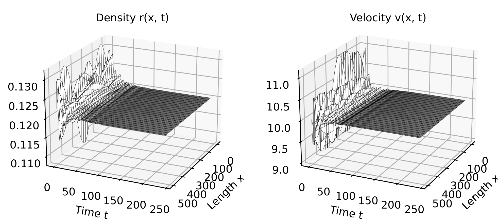
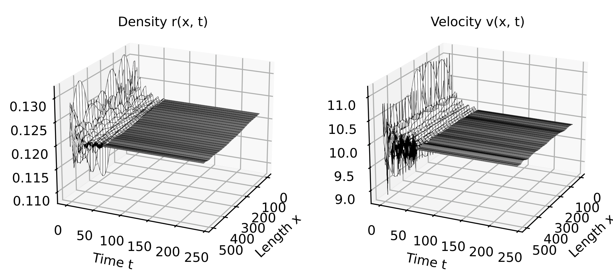

.. _Trafficarz1d_tutorial:

Traffic ARZ PDE Tutorial
=========

This tutorial will follow the Jupyer-notebooks found at `github <https://github.com/lukebhan/PDEControlGym/blob/main/examples/TrafficPDE1D>`_. We will explore the traffic ARZ PDE environment, which consists of 1D coupled hyperbolic PDEs that models traffic flow on freeways. The contontrol objective is to stabilize the traffic flow to a desired steady state traffic density and velocity.

We first start by initializing the :class:`~pde_control_gym.src.environments.TrafficARZ1D` environment. The environment is initialized with the following parameters:

.. code-block:: python

    T = 240
    dt = 0.25
    dx = 10
    X = 500

    from pde_control_gym.src import TrafficARZReward
    reward_class =  TrafficARZReward()

    Parameters = {
            "T": T, 
            "dt": dt, 
            "X": X,
            "dx": dx, 
            "reward_class": reward_class,
            "simulation_type" : 'inlet', 
            "v_steady" : 10,
            "ro_steady" : 0.12,
            "v_max" : 40,
            "ro_max" : 0.16,
            "tau" : 60
    }

Detailed explanation about the parameters can be found in the `TrafficARZ1D <../environments/Trafficarz1d.html>`_ environment documentation. A short description of the parameters we have initialized is as follows:

- ``T``: Total simulation time in seconds.
- ``dt``: Time step in seconds.
- ``X``: Length of the road in meters.
- ``dx``: Spatial step in meters.
- ``reward_class``: The reward class to be used for the environment. In this case, we use the ``TrafficARZReward`` class.
- ``simulation_type``: The type of simulation to be run. In this case, we use the ``inlet`` simulation type, which means that the traffic flow is controlled at the inlet of the road.
- ``v_steady``: The desired steady state velocity of the traffic flow in meters/second.
- ``ro_steady``: The desired steady state traffic density in vehicles/meter.
- ``v_max``: The maximum velocity of the traffic flow in meters/second permissible on freeway.
- ``ro_max``: The maximum traffic density in vehicles/meter permissible on freeway.
- ``tau``: The time taken by drivers to adjust to new traffic conditions in seconds.

We can now instantiate the trafficARZ environment as follows:

.. code-block:: python

    from pde_control_gym.src.environments import TrafficARZ1D
    envBcks = gym.make("PDEControlGym-TrafficPDE1D",**Parameters)

Before, bulinding the controller model, we need to define a function that sequentially applies the control actions to the environment. This function will be used to run a simulation episode and store the data obtained from each timestep for further analysis. The function will take a model (controller) and an environment as input, and it will return the cumulative reward, the environment state history, the action history, and the reward history as follows:

.. code-block:: python

    def runSingleEpisode(model, env, parameter = None):
        terminate = False
        truncate = False

        # Holds the resulting states 
        uStorage = []

        # Reset Environment
        obs,__ = env.reset()
        uStorage.append(obs)

        ns = 0
        i = 0

        #Cummulative reward
        rew = 0

        #Storing action and reward history
        act_h = []
        rew_h = []
        
        while not truncate and not terminate:
            action = model(env,obs,parameter)
            act_h.append(action)
            obs, rewards, terminate, truncate, info = env.step(action)
            uStorage.append(obs)
            rew += rewards
            rew_h.append(rewards)
            ns += 1
        u = np.array(uStorage)
        return rew, u, act_h, rew_h

PDE Backstepping Controller
--------------------------------------

Let :math:`\rho(x,t)`, :math:`v(x,t)` and :math:`q(x,t)` represent the traffic density, velocity, and traffic flux respectively and the control objective is to stabilze the values of these parameters around :math:`\rho^\star`, :math:`v^\star`, and :math:`q^\star` respectively. The detailed explanations of the notations can be found in `TrafficARZ1D <../environments/Trafficarz1d.html>`_ environment documentation. The PDE backstepping controller is designed to achieve this control objective by applying a control input :math:`q(x=0, t)` and :math:`q(x=L, t)` at the boundaries of the freeway. 

The inlet backsteeping controller is given by the following equation:

.. math::
    :nowrap:

    \begin{align}
    q(x=0, t) = q^\star
    \end{align}

The kernels for outlet backsteeping controller are given by:

.. math::
    :nowrap:

    \begin{align}
    K(x) &= -\frac{\gamma \cdot p^\star}{\tau} \cdot e^{-x / (\tau v^\star)} \\
    M(x) &= -K(x)
    \end{align}

Where, :math:`\gamma` is a scaling factor and :math:`p^\star = \frac{v_{max} r^\star}{r_{max}}`. We now define the following characteristic speeds of the backstepping controller:

.. math::
    :nowrap:

    \begin{align}
    \lambda_1 &= v^\star\\
    \lambda_2 &= v^\star + \rho^\star \cdot \left( -\frac{\rho_{max}}{v_{max}} \right)

    \end{align}

The spatial feedback weights are given by:

.. math::
    :nowrap:

    \begin{align}
    {c_v(x)} &= M(x) + \frac{\lambda_1}{\lambda_2} K(x) e^{x / (\tau v^\star)}  \\
    c_q(x) &= \left( \frac{\lambda_1}{\lambda_1 - \lambda_2} \right) K(x) e^{x / (\tau v^\star)}
    \end{align}

Then the outlet boundary control input is given by:
 
 .. math::
    :nowrap:

    \begin{align}
    q(x = L, t) = q^\star + \rho^\star \int_0^L c_v(x) (v(x) - v^\star) \, dx + \int_0^L c_q(x) (q(x) - q^\star) \, dx
    \end{align}

The below code implements the above equations to create a backstepping controller for the inlet and outlet control scenarios.

.. code-block:: python

    def bcksController(env, obs, parameter=None):
        if env.unwrapped.simulation_type == 'inlet':
            #Inlet control
            return env.unwrapped.qs
            
        elif env.unwrapped.simulation_type == 'outlet' or env.unwrapped.simulation_type == 'both':
            #Outlet control
            x = np.arange(0, env.unwrapped.L + env.unwrapped.dx, env.unwrapped.dx)
            lambda1 = env.unwrapped.vs
            lambda2 = env.unwrapped.vs + env.unwrapped.rs * (-env.unwrapped.vm / env.unwrapped.rm)

            gamma = 1
            K_kernel = -(1 / (gamma * env.unwrapped.ps)) * (-1 / env.unwrapped.tau) * np.exp(-x / (env.unwrapped.tau * env.unwrapped.vs))
            M_kernel = - K_kernel
        
            cv = M_kernel + (lambda2 / lambda1) * K_kernel * np.exp(x / (env.unwrapped.vs * env.unwrapped.tau))
            cq = ((lambda1 - lambda2) / lambda1) * K_kernel * np.exp(x / (env.unwrapped.vs * env.unwrapped.tau))
        
            v = env.unwrapped.v
            q = env.unwrapped.r * env.unwrapped.v
            v_err = v - env.unwrapped.vs
            q_err = q - env.unwrapped.qs
        
            integral_v = np.trapz(cv.flatten() * v_err.flatten(), dx=env.unwrapped.dx)
            integral_q = np.trapz(cq.flatten() * q_err.flatten(), dx=env.unwrapped.dx)

            q_out = env.unwrapped.qs + env.unwrapped.rs * integral_v + integral_q
            
            if env.unwrapped.simulation_type == 'outlet':
                return q_out
            else:
                return (env.unwrapped.qs,q_out)

The below command will run the simulation episode using the backstepping controller we have defined above:

.. code-block:: python

    rew, u, act_h, rew_h = runSingleEpisode(bcksController, envBcks, None)

The trajectory obtained after backstepping control for simultaneous inlet and outlet control is shown below. It can be observed that the traffic density and velocity converge to the desired steady state values.

Reinforcement Learning Controller
--------------------------------------

The Reinforcement Learning (RL) controller uses Proximal Policy Optimization (PPO) to stabilize traffic flow by controlling boundary conditions. This approach learns optimal control policies through interactions with the environment. We start by intializing the gym for training. 

.. code-block:: python

    T = 240
    dt = 0.25
    dx = 10
    X = 500

    from pde_control_gym.src import TrafficARZReward
    reward_class =  TrafficARZReward()

    Parameters = {
            "T": T, 
            "dt": dt, 
            "X": X,
            "dx": dx, 
            "reward_class": reward_class,
            "simulation_type" : 'outlet-train', 
            "v_steady" : 10,
            "ro_steady" : 0.12,
            "v_max" : 40,
            "ro_max" : 0.16,
            "tau" : 60, 
            "limit_pde_state_size" : True,
            "control_freq" : 2
    }    

Here, the ``limit_pde_state_size`` parameter is set to ``True`` to limit the size of the PDE state space to ensure numerical stability while traning, and the ``control_freq`` parameter is set to ``2`` to simulate the PDE twice per action. This give the RL model more time to learn the optimal control action. 

Then, we deaclare some callbacks to log the training metrics to TensorBoard and to save the model checkpoints during training. 

.. code-block:: python

    #Declaring required callbacks for checkpointing and logging
    checkpoint_callback = CheckpointCallback(
    save_freq=50000,
    save_path="./logsPPO",
    name_prefix="rl_model",
    save_replay_buffer=True,
    save_vecnormalize=True,
    )

    class RewardLoggingCallback(BaseCallback):
        def __init__(self, verbose=0):
            super(RewardLoggingCallback, self).__init__(verbose)

        def _on_step(self):
            # Log the rewards at each step to TensorBoard
            self.logger.record('reward', np.mean(self.locals['rewards']))
            return True
    reward_logging_callback = RewardLoggingCallback()
    callback_list = CallbackList([checkpoint_callback,reward_logging_callback])

The traning of the PPO policy is done using Stable Baselines3 library for 2,000,000 timesteps as follows:

.. code-block:: python

    Parameters["simulation_type"] = 'outlet-train'
    envRL = gym.make("PDEControlGym-TrafficPDE1D",**Parameters)

    model = PPO("MlpPolicy",envRL, verbose=1, tensorboard_log="./tb/")

    #Training the model (Trained models are avaiable in our HuggingFace repo)
    model.learn(total_timesteps=2000000, callback=callback_list)

The trained model is available in our HuggingFace repository at `PDEControlGymModels <https://huggingface.co/lukebhan/PDEControlGymModels/tree/main/trafficARZModels>`_. These models can be directly used to run the simulation episodes  without running the above training code.

Now, we define a RL controller function that uses the trained PPO model to control the traffic flow. The function takes the environment, previous timestep observation and the trained model as input and returns the control action:

.. code-block:: python

    def RLController(env,obs,model):
        
        #Normalization of observation space
        half = obs.shape[0] // 2
        r = obs[:half]
        v = obs[half:]
        obs_sc = np.reshape(
            np.concatenate(((r - env.unwrapped.rs) / env.unwrapped.rs, (v - env.unwrapped.vs) / env.unwrapped.vs)),
            -1
        )

        #Predicting action using RL model
        action, _state = model.predict(obs_sc)
        
        if env.unwrapped.simulation_type == 'outlet':
            return action[0]
        elif env.unwrapped.simulation_type == 'both':
            return (env.unwrapped.qs, action[0])

Note that the PPO algorithm performs better with normalized observation space and the same is used while training the model. So, the action prediction should also be done using the normalized observation space.

Finally, the simulation episode can be run using the trained RL controller as follows:

.. code-block:: python

    Parameters["simulation_type"] = 'both'
    Parameters["control_freq"] = 1
    PPO_model = PPO.load('./logsPPO/rl_model_1500000_steps.zip')
    env = gym.make("PDEControlGym-TrafficPDE1D",**Parameters)
    rew, u, act_h, rew_h = runSingleEpisode(RLController, env, PPO_model)

Here, the ``control_freq`` to ``1`` to simulate the PDE once per action. 

The trajectory obtained after RL control for simultaneous inlet and outlet control is shown below. Again, it can be observed that the traffic density and velocity converge to the desired steady state values.

The reward curve obtained during RL training is shown below. We can observe that it begins with low values and gradually increases, eventually saturating as the model learns to stabilize traffic flow.

 