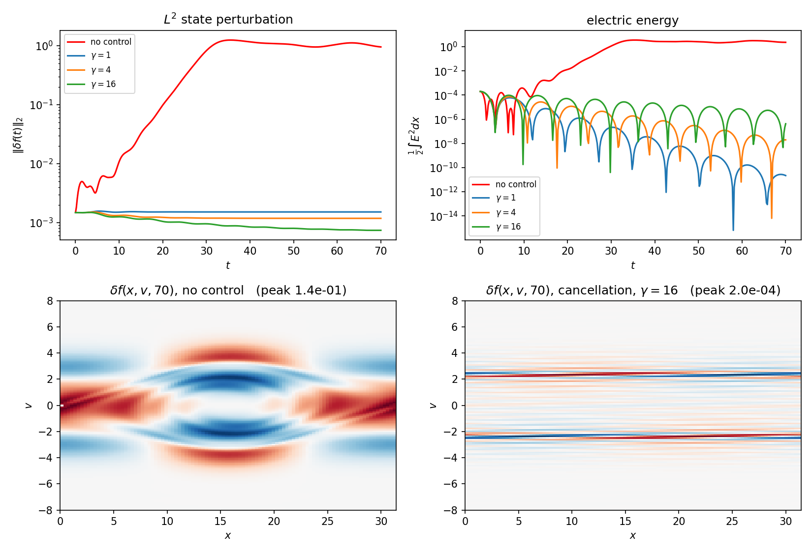
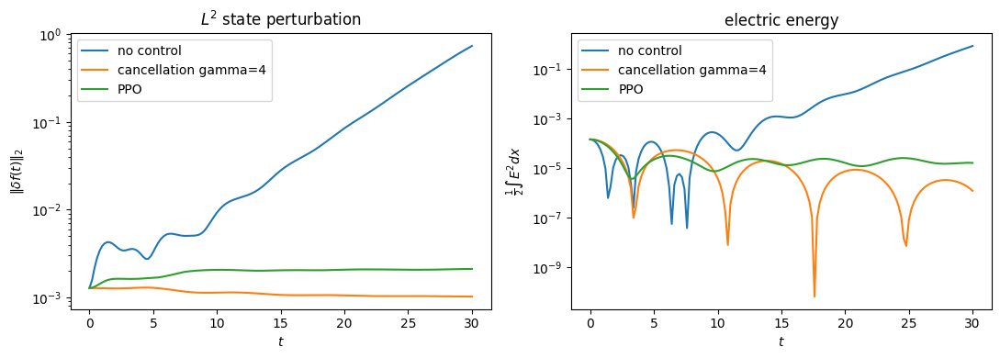
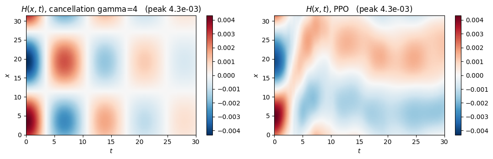
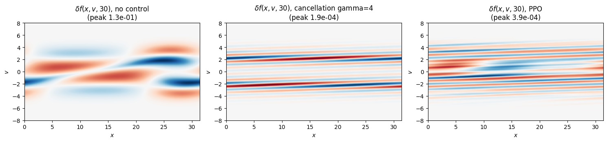

.. _vlasovpoisson1d_tutorial:

1D Vlasov-Poisson PDE Tutorial
==============================

This tutorial follows the Jupyter notebook found at `github
<https://github.com/lukebhan/PDEControlGym/blob/main/examples/vlasovPoisson>`_. We explore
the `Vlasov-Poisson environment <../environments/vlasovpoisson-1d.html>`_, a kinetic model
of a collisionless plasma in which the state is a distribution :math:`f(x,v,t)` over phase
space. The control objective is to hold the plasma at an unstable equilibrium
:math:`\bar f(v)` by applying an external electric field :math:`H(x,t)`.

Two features distinguish this problem from the others in the gym, and both shape everything
below. First, the domain is periodic, so there is no boundary to act through and the
actuator is *distributed* across the whole domain. Second, large parts of the state are
provably unreachable by any control, so the goal is to suppress the macroscopic signature
of the instability rather than to drive the perturbation to zero. The
`environment documentation <../environments/vlasovpoisson-1d.html>`_ works through exactly
which parts are reachable.

Initializing the gym
--------------------

We use the two-stream equilibrium of Section 3.2 of the paper on a periodic domain of
length :math:`10\pi`.

.. code-block:: python

    import gymnasium as gym
    import numpy as np
    import pde_control_gym
    from pde_control_gym.src import VlasovPoissonReward
    from utils import twoStreamEquilibrium, multiplicativePerturbation

    X, nx = 10 * np.pi, 100      # periodic spatial domain and grid
    V, nv = 8.0, 129             # truncated velocity domain and grid
    T, dt = 30.0, 0.2            # horizon and solver timestep

    fbarFunc = twoStreamEquilibrium(vbar=2.4)
    xGrid = np.linspace(0, X, nx, endpoint=False)
    vGrid = np.linspace(-V, V, nv)
    fbar = fbarFunc(xGrid, vGrid)

    Parameters = {
            "T": T,
            "dt": dt,
            "X": X,
            "dx": X / nx,
            "V": V,
            "dv": 2 * V / (nv - 1),
            "reward_class": VlasovPoissonReward(
                fbar=fbar, dx=X / nx, dv=2 * V / (nv - 1),
                gamma=0.0, nt=int(round(T / dt)) + 1,
            ),
            "normalize": False,
            "reset_init_condition_func": multiplicativePerturbation(fbarFunc, 1e-3, 1, X),
            "equilibrium_func": fbarFunc,
            "sensing_type": "full",
            "action_type": "modal",
            "num_modes": 2,
            "include_uniform_mode": False,
            "max_control_value": 1.0,
            "control_sample_rate": dt,
            "store_history": False,
    }

    env = gym.make("PDEControlGym-VlasovPoisson1D", **Parameters)

A detailed explanation of every parameter is in the
`VlasovPoisson1D <../environments/vlasovpoisson-1d.html>`_ environment documentation. A
short description of the ones set here:

- ``T``, ``dt``: the horizon and the solver timestep, in plasma time units.
- ``X``, ``dx``: the length of the periodic spatial domain and its grid spacing.
- ``V``, ``dv``: the velocity domain is :math:`[-V, V]`, truncated because :math:`f` decays
  rapidly, with grid spacing ``dv``.
- ``reward_class``: the running cost. ``VlasovPoissonReward`` implements
  :math:`-\tfrac12 \|\delta f\|^2 - \tfrac{\gamma}{2}\|H\|^2` from equation (2.2) of the
  paper. The paper reports its best results at :math:`\gamma = 0`, which is the default.
- ``reset_init_condition_func``: the initial condition, here
  :math:`f_0 = (1 + \epsilon \cos(2\pi m x / X))\bar f(v)` with :math:`\epsilon = 10^{-3}`
  seeded in harmonic :math:`m = 1`.
- ``equilibrium_func``: the target :math:`\bar f`. Must be an equilibrium of the
  *uncontrolled* system, which any :math:`\bar f(v)` is.
- ``sensing_type``: what the agent observes. ``"full"`` returns all of
  :math:`\delta f(x,v)`, ``"density"`` returns :math:`\delta\rho(x)`, ``"field"`` returns
  :math:`\delta E(x)`, and ``"moments"`` returns the first three velocity moments.
- ``action_type``, ``num_modes``, ``include_uniform_mode``: the actuator. Here the control
  is the first two Fourier harmonics with the uniform component removed, so the action has
  four entries.
- ``store_history``: whether to retain the whole ``(nt, nx, nv)`` trajectory. Set it to
  ``False`` for long runs on fine grids.

As with the other environments, we define a helper that runs one episode and collects what
we need for analysis. ``runEpisode`` in ``utils.py`` does this, returning the accumulated
reward together with per-step traces of the perturbation norm, the electric energy, the
momentum and the applied field:

.. code-block:: python

    def runEpisode(env, policy):
        obs, info = env.reset()
        trace = {k: [info[k]] for k in ("l2_perturbation", "electric_energy", "momentum")}
        fields, paper = [], 0.0
        terminate = truncate = False
        while not (terminate or truncate):
            obs, reward, terminate, truncate, info = env.step(policy(obs))
            paper += info.get("paper_reward", reward)
            for k in trace:
                trace[k].append(info[k])
            fields.append(info["H"])
        trace = {k: np.array(v) for k, v in trace.items()}
        trace["H"] = np.array(fields)
        return paper, trace

Which harmonics need controlling
--------------------------------

Because the linearized system decouples across spatial harmonics, an actuator restricted to
a set of harmonics acts on exactly those harmonics and no others. It is therefore worth
measuring which ones actually grow before choosing an action space. Running the uncontrolled
system with a single harmonic seeded and fitting the growth rate of :math:`|E|` gives

.. code-block:: text

     mode      k    growth rate of |E|   ||df(T)||/||df(0)||
       1    0.20         +0.2503                557.5
       2    0.40         +0.1580                25.96
       3    0.60         -0.2722                1.217
       4    0.80         -0.2593                1.146
       5    1.00         -0.0907                1.078
       6    1.20         -0.0294                1.005

Only harmonics 1 and 2 grow; from harmonic 3 up the modes are Landau damped and take care
of themselves. That is why ``num_modes=2`` above, and why the training task seeds only
those two harmonics. Adding actuator modes beyond the unstable ones costs search space
without buying authority over anything that matters.

Cancellation-based controller
-----------------------------

Before training anything, we build the analytic baseline. Subtracting the equilibrium from
the governing equation gives the perturbation dynamics

.. math::
    :nowrap:

    \begin{align}
    \partial_t \delta f + v \partial_x \delta f + E \partial_v \delta f + (\delta E + H) \partial_v \bar f = 0, \tag{1}
    \end{align}

where :math:`\delta E = E - \bar E` is the perturbation of the self-consistent field. The
instability is driven entirely by the :math:`\delta E \partial_v \bar f` term, so the
natural move is to cancel it outright and add a dissipation term on top,

.. math::
    :nowrap:

    \begin{align}
    H[\delta f](x) = -\delta E[\delta f](x) + \delta H[\delta f](x). \tag{2}
    \end{align}

Substituting (2) into (1) and testing against :math:`\delta f`, the streaming and
:math:`E \partial_v \delta f` terms integrate away, since
:math:`\int \delta f \partial_v \delta f\, dv = 0` for any :math:`v`-independent
coefficient, leaving

.. math::
    :nowrap:

    \begin{align}
    \frac{1}{2}\frac{d}{dt}\|\delta f(t)\|_2^2 = -\int \delta H(x,t) \left( \int \delta f(x,v,t)\, \partial_v \bar f(v)\, dv \right) dx. \tag{3}
    \end{align}

Choosing :math:`\delta H` to be exactly the inner integral makes the right hand side a
negative square, so for any gain :math:`\gamma > 0` the perturbation norm is nonincreasing:

.. math::
    :nowrap:

    \begin{align}
    H[\delta f](x) &= -\delta E[\delta f](x) + \gamma \int \delta f(x,v,t)\, \partial_v \bar f(v)\, dv, \tag{4} \\
    \frac{1}{2}\frac{d}{dt}\|\delta f(t)\|_2^2 &= -\gamma \int \left( \int \delta f\, \partial_v \bar f\, dv \right)^{2} dx \;\le\; 0. \tag{5}
    \end{align}

This law requires no training, depends only on the target equilibrium, and therefore
transfers across initial conditions. Note carefully what (5) does *not* say: only the
component of :math:`\delta f` aligned with :math:`\partial_v \bar f` in velocity appears on
the right hand side, so the orthogonal complement is not directly damped. Whether it decays
anyway is left open in Section 5 of the paper.

``CancellationController`` in ``utils.py`` implements (4), projecting the resulting field
onto whatever actuator basis the environment exposes:

.. code-block:: python

    class CancellationController:
        def __init__(self, env, gamma=1.0):
            self.env = env
            self.gamma = gamma
            self.projector = np.linalg.pinv(env.control_basis)
            self.scale = env.max_control_value if env.normalize_actions else 1.0

        def action(self, df):
            env = self.env
            dE = env.solve_poisson(env.density(df))
            dissipation = self.gamma * np.trapezoid(df * env.dvfbar, dx=env.dv, axis=1)
            H = -dE + dissipation
            return self.projector @ H / self.scale

Because of the velocity integral, this controller needs ``sensing_type="full"``. Running it
against the uncontrolled system:

.. code-block:: python

    from utils import CancellationController, runEpisode

    openLoopReward, openLoop = runEpisode(env, lambda obs: np.zeros(env.unwrapped.action_dim))
    controller = CancellationController(env.unwrapped, gamma=4.0)
    closedLoopReward, closedLoop = runEpisode(env, controller.action)

Over :math:`t \in [0, 70]` the uncontrolled perturbation grows by a factor of 645 and
saturates into the classic two-stream phase-space vortex, while the controlled runs stay
flat, with larger :math:`\gamma` giving faster decay. The electric energy is suppressed by
five to six orders of magnitude.

Reinforcement learning controller
---------------------------------

The RL controller uses Proximal Policy Optimization to learn the feedback law from
interaction instead. Two adjustments are needed first, and they are worth understanding
rather than copying.

**Conditioning.** An unstable perturbation grows two to three orders of magnitude within a
single episode, so the observation spans that range and the quadratic cost spans its
square. No fixed set of network weights responds usefully at both ends. On top of that the
useful control amplitude is small and phase-sensitive, so exploration noise at a comparable
scale drives the instability rather than damping it. ``ScaleFreeVlasov`` in ``utils.py``
handles this by making the problem scale free: it divides the observation by its own
magnitude and appends :math:`\log_{10}` of that magnitude, interprets the action as a
multiple of the same magnitude, and replaces the reward by the per-step log growth factor,
whose episode sum is :math:`-\log` of the overall growth. The paper's quadratic cost is
still computed and returned under ``info["paper_reward"]``, so it remains the reported
metric even though it is not the training signal.

Factoring out the amplitude is justified by the structure of the problem: Section 2.1 of
the paper shows via the Pontryagin maximum principle that the optimal control for the
linearized system is a linear functional of :math:`\delta f`, hence positively homogeneous
in it, so one set of weights represents that law at every amplitude once the scale is
removed.

**Sensing.** We switch to ``sensing_type="field"``, so the agent observes :math:`\delta E`,
which is precisely the quantity the leading term of (4) has to cancel.

.. code-block:: python

    from utils import ScaleFreeVlasov

    GAIN = 3.0     # an action of +-1 means +-3 times the observed field magnitude
    N_ENVS = 4

    Parameters["sensing_type"] = "field"
    Parameters["limit_pde_state_size"] = True
    Parameters["max_state_value"] = 10.0

    def makeTrainingEnv(rank):
        return lambda: ScaleFreeVlasov(
            gym.make("PDEControlGym-VlasovPoisson1D", **Parameters), gain=GAIN
        )

Before training, it is worth confirming the wrapped action space contains a stabilizing
policy at all. Since the observation *is* :math:`\delta E`, the leading term of (4) can be
written down directly in wrapper coordinates, and it holds the perturbation flat at a
growth factor of 1.08. Had this failed, no amount of training would have helped.

.. code-block:: python

    def idealFieldCancellation(vp):
        projector = np.linalg.pinv(vp.control_basis)
        return lambda obs: np.clip(-(projector @ obs[:-1]) / GAIN, -1, 1)

We then declare the usual callbacks for TensorBoard logging and checkpointing, and train:

.. code-block:: python

    from stable_baselines3 import PPO
    from stable_baselines3.common.callbacks import BaseCallback, CallbackList, CheckpointCallback
    from stable_baselines3.common.vec_env import DummyVecEnv

    class RewardLoggingCallback(BaseCallback):
        def __init__(self, verbose=0):
            super(RewardLoggingCallback, self).__init__(verbose)
            self.history = []

        def _on_step(self):
            mean = float(np.mean(self.locals["rewards"]))
            self.logger.record("reward", mean)
            self.history.append(mean)
            return True

    callbacks = CallbackList([
        CheckpointCallback(save_freq=100_000, save_path="./logsPPO", name_prefix="rl_model"),
        RewardLoggingCallback(),
    ])

    vecEnv = DummyVecEnv([makeTrainingEnv(i) for i in range(N_ENVS)])

    model = PPO(
        "MlpPolicy", vecEnv, verbose=0, seed=0,
        n_steps=256, batch_size=256, learning_rate=3e-4, ent_coef=0.0,
        tensorboard_log="./tb/",
        policy_kwargs=dict(net_arch=[64, 64], log_std_init=-1.5),
    )
    model.learn(total_timesteps=600_000, callback=callbacks)

Two settings here are not free choices. The learning rate is tied to the architecture: at
``lr=1e-3`` this same network diverges, reaching growth factors of 74 and 135 by 400k steps
on two seeds, and ``net_arch=[256, 256]`` settles around 900, worse than applying no control
at all. Keep the activation at tanh, since a tanh network near initialization is close to a
linear map, which is roughly where a good policy for this problem lives. Separately,
``log_std_init=-1.5`` keeps the initial exploration below the useful control amplitude;
left at the default, exploration destabilizes the plasma faster than the learning signal
accumulates and the run never recovers.

The notebook evaluates the deterministic policy every 50k steps on a fixed set of eight
episodes, so the learning curve is available in the units we care about. The agent drops
from a growth factor of 10 to about 1.2 by 350k steps and then plateaus just above the
analytic law.

.. figure:: ../_static/img/vlasovPoissonRLCurves.png
   :align: center

Scoring every policy on the same fixed episodes gives

.. code-block:: text

    policy                       paper reward   geo-mean growth
    no control                    -2.6308e+00             117.4
    cancellation gamma=1          -3.3079e-04            0.9926
    cancellation gamma=4          -2.5851e-04            0.8227
    cancellation gamma=16         -1.8494e-04            0.6222
    ideal -dE                     -3.7155e-04             1.079
    PPO                           -4.3674e-04             1.221

The growth factors are reported as a geometric mean, since a growth factor is multiplicative
across episodes with a spread of growth rates. Single checkpoints are noisy for this
problem, so the curve above is more informative than any one row of the table.

The trajectories show the uncontrolled perturbation growing exponentially while both
feedback laws hold it flat and suppress the electric energy by orders of magnitude.

Comparing the fields the two controllers actually apply, the learned policy has recovered
the same spatial structure and the same peak amplitude as the analytic law, and drives the
perturbation down early before going quiet.

Finally, the phase space at the end of the episode. Without control the distribution has
rolled up into the characteristic two-stream vortex; under either controller only fine
filamentation near the beams remains, three orders of magnitude smaller.

Note that the filaments do not disappear under control, and cannot. Every Casimir of
:math:`f` is invariant under any control whatsoever, so :math:`\|\delta f\|_2` can only be
driven to zero if :math:`f_0` happens to be a measure-preserving rearrangement of
:math:`\bar f`. Suppressing the field and the low-order moments, which is what both
controllers achieve, is the goal that is actually attainable here.
